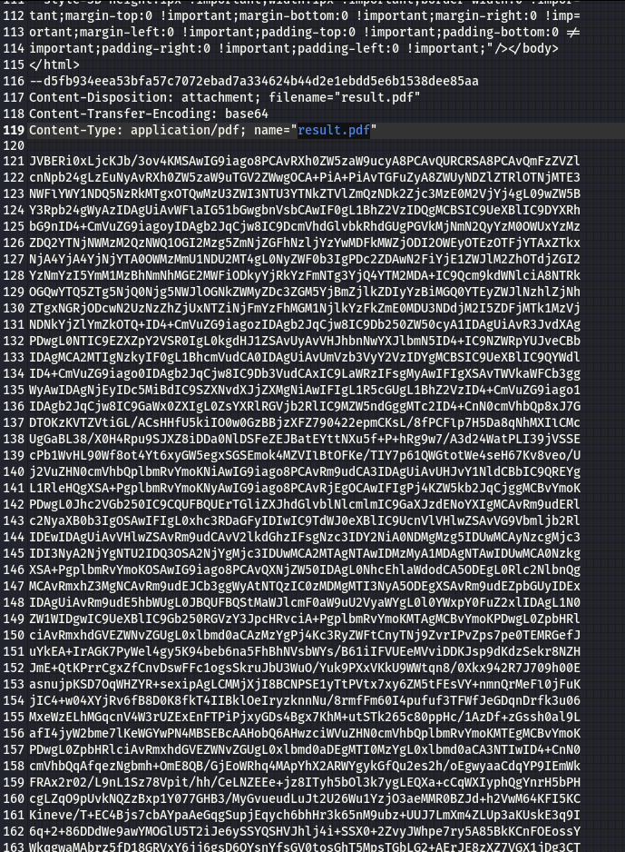
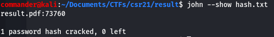

# Result (misc, Crypto)

## Description

>I really want to know my test result, but unfortunately its additionally protected. I attached the email. Maybe you can help?

## Solution

### Downloading the required file

I downloaded the provided zip file and extracted the email contained inside. Opening the email in Sublime, i can see that the email has a .pdf attachment.

There is also reference to password protection and the structure of the password. This will form the basis of the wordlist i make a little later.

### Extracting the .pdf

Next step was to extract the .pdf file from the email so i copy the block of base64 encoded data from the email and paste it into cyberchef. Add the "from base64" recipe and you can see the .pdf file in the results section. 

I saved the file to my local machine and tried to open it, where i was met with a password prompt.

I'm going to use johnTheRipper to crack the password since i know the password is a series of numbers so an existing wordlist will not help. For this i need 2 things, firstly i need to extract the hash from the file using pdf2john.pl and the second thing i need to do is generate a wordlist containing zipcodes to bruteforce the password.

### Extracting the Hash

John the Ripper comes with Kali and is located by default in /usr/share/john. Here you can list the scripts that are preinstalled to find the right one for your purpose. I used pdf2john.pl and specified the pdf i saved from cyberchef "result.pdf" and asked it to output the hash to a file called "hash.txt" where i can crack it later. Below you can see the output of the file hash.txt which contains the password hash from the .pdf file.

### Generating custom wordlist

For this task i used crunch which comes prepackaged in Kali. The usage is pretty simple for this task. I know that postcodes/zipcodes are all numbers (0123456789) and are between 4 and 6 characters in length depending on what country you are in around the world. Given this CTF is being run in Germany there was a chance that i could have made an error in my assumption here but if this failed, a quick google of German zipcodes would have allowed me to adjust the wordlist. The command below specifies passwords between 4 and 6 characters in length using all nuumbers and outputting the wordlist to a file called passlist.txt and i verified that the file was created.

Next i verified that the wordlist was created as expected. I used crunch over writing a small python script printing a cumber range to file because i wanted to pad 0's to ensure my password list started at "0000" and it would have taken a lot more code in python to ensure i was padding to min 4 characters in lenght than it would take to write a short cunch command. Below is the first 3 lines and last 3 lines of my generated password list to ensure it starts and finishes as expected.

### Cracking the password

Now i am ready to crack the password using john, i just need to feed it the file containing the hash i want cracked, and also the passwordlist list i generated containing zipcodes to bruteforce the password. As you can see, john successfully cracked the password with my wordlist.

Use --show with john to display the discovered password for the hash file. The password is 73760

### Flag

Final step is to enter the password into the document and open it. #profit

flag= CSR{BigBigEntropy}

