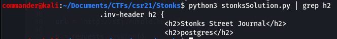

# Stonks Street Journal (web, expl)

## Description

>No Description (pretty brutal huh) [Link to webApp](http://ssj.rumble.host/)

## Solution

This wasn't an easy SQLi task and i needed some direction from a friend to get over the line with this one. No automated tools such as SQLMAP worked on this challenge.

Firstly, when you click on the link you are presented with the Stonks Street Journal landing page. 

There are buttons all over the page however nothing works and as soon as you click anywher on the page you are taken to the register page at http://ssj.rumble.host/register

I created an account to see what occured before i bothered injecting any commands and was taken to the profile of my newly created account at http://ssj.rumble.host/profile

Clicking on the link to the invoice i was presented with an invoice containing all of the information i just entered, as well as some other random irrelevant fields. 

Of note however, was the URI. We are now at http://ssj.rumble.host/legacy_invoice_system/YnVycF9ndXktMjAyMS0xMS0yOA==.

First step i took was to take the base64 encoded string at the end of the URI and decode it *This value will change in most images throughout this writeup as i fiddled with it and took screenshots at differing stages. 
I copied and pasted it into cyberchef with the "From base64" recipe and discovered that it is just made up of the username i chose and the date the account was created in the following format.

So now i had the idea to try and modify this value and see if i can find the flag in someone elses invoice. Naturally i changed the username to Administrator, re-encoded it in base64 using cyberchef and then pasted it in the URL bar substituting the previous value that was there. Boom! Administrators invoice however nothing of value from this.  

So i continued crafting strings with different peoples names to see what i could find. When i entered a first and last name separated by a hyphen however, i received a different kind of response. This was due to the backend expected only a date after the first hyphen in format '-yyyy-mm-dd'

Now that i have figured out there must be some SQL on the backend here i might be able to exploit it so i'm going to test for the type of database by asking it for its version. I do this by crafting an SQLi statement with a request for the version in each type of databases language. If it throws an error, then it's not that type of database. First up was to test for MySQL so, in Cyberchef i wrote the following statement asking "@@version" (which is the syntax for the version of MySQL and MSSQL) before encoding it in base64 and pasting in the URL bar.

This returns the following output in my browser which tells me the database is neither of those.

Next was to test for PostGres so i crafted the statement in cyberchef including "SELECT	version()--" and re-submitted it.

This returned a different error than before. This tells me 2 things. First, the database is PostGres and second, it requires 7 inputs in order to execute properly. 

From here i could continue expanding the SQLi to return the actual version of PostGres but in this case i wasn't interested and continued anyway. I crafted a query where i entered both the name and signup date as '*' separated by a hyphen '-' e.g. '*-*' to see how the unusual data was handled. The following error gave me some really valuable information.

We can see an invalid syntax error where part of the statement is revealed. We can assume the section preceeding the 'WHERE' clause is the 'FROM' section and most likely the table name. Given what i know from some quick PostGres DB doc pages, all new DB's contain a 'public' schema and tables and objects are added to this by default. The syntax for this is <schema>.<tableName> so from this image i can safely assume that the table name is news_subscriber belonging to the public schema.

I'm gathering some great info here but doing this all manually through Cyberchef is quite painful and so i sought some help from a friend to create a python script to send my crafted queries and grep the results. I crafted some queries containing the 7 required fields as indicated earlier to probe what data was required where and how i could retrieve some info. Of the 7 columns supplied, i learnt that the 2nd column was the one that would return the data i was asking for.

## Enumerating the database names

I had zero experience with PostGreSQL prior to this but a quick flick through the docs showed that all databases are contained in the catalogue 'pg_database', so this is what we have to query to get a list of the database names. The column i will need to target is called 'datname' which contains a list of the database names. I crafted the following query in my python script which encoded it as base64 and submitted it at the end of the URI I was using in the browser.
>blah' or '1'='1-2011-11-22' or username like '%ralph%' union SELECT 1, datname ,'col3', 35,'email5','cardnumber6','2011-11-21' FROM pg_database LIMIT 1 OFFSET 2-- "

The final URI looked like this
>http://ssj.rumble.host/legacy_invoice_system/IGJsYWgnIG9yICcxJz0nMS0yMDExLTExLTIyJyBvciB1c2VybmFtZSBsaWtlICclcmFscGglJyB1bmlvbiBTRUxFQ1QgMSwgZGF0bmFtZSAsJ2NvbDMnLCAzNSwnZW1haWw1JywnY2FyZG51bWJlcjYnLCcyMDExLTExLTIxJyBGUk9NIHBnX2RhdGFiYXNlIExJTUlUIDEgT0ZGU0VUIDItLSA=

The union statement provides 7 inputs with the second querying 'datname' column from the 'pg_databse' catalogue. LIMIT restricts the query to only return one result at a time since we only have one column in the invoice in which to view the returned information. The OFFSET provides a way of iterating over each row in the column allowing me to reference each row one at a time. This also means i have to manually change this value and resubmit for every row in the column(due to the connection being rate limited, no quicker automation could be scripted or it would be dropped). Iterating through OFFSET 0,1,2 I returned 3 table names template0, template1 and postgres. Below images show the result of OFFSET 2 when submitted via python script and grepping for the HTML tag 'h2' where the date is returned, and also when submitting the query in the browser and viewing the result returned in the invoice.

## Enumerating the table names

Assuming that all the data i need is in the PostGres database, now it's time to enumerate all of the tables in the databse to see if we can narrow down which table might hold the data that i need to save manually pulling all data from all tables. I used the last query as a template as i just need to make a few small changes. Now, according to the PostGreSQL docs i am looking for 'table_name' instead of 'datname' and i am looking for that info in the public table schema which we discovered before and is contained in the information_schema.tables which can be seen in the query below. I will start at OFFSET 0 and increment that number by 1 with each request to pull back each table name 1 by 1.
>blah' or '1'='1-2011-11-22' or username like '%ralph%' union SELECT 1, table_name,'col3', 35,'email5','cardnumber6','2011-11-21' FROM information_schema.tables WHERE table_schema = 'public' LIMIT 1 OFFSET 10 -- -" 

This query returned the following list of table names based on the supplied OFFSET.
>OFFSET 0=auth_group, 1=django_admin_log, 2=auth_group_permissions, 3=auth_user_user_permissions, 4=news_article, 5=django_content_type, 6=django_migrations, 7=auth_user_groups, 8=auth_permission, 9=auth_user, 10=news_subscriber

This is where CTFs differ from SQLi in the wild, where do i find the profit. Clearly this CTF isn't super easy and so there isn't anything glaringly obvious about the table names. Given the news theme of the website name and content, i am going to assume that what i'm looking for is in 'news_article' or 'news_subscriber' tables and i'm going to target the news_article.

## Enumerating the column names

Making some minor changes to my previous query, now i am looking for 'column_name' and I am seaching the table 'news_article' within 'information_schema.columns'. I again start at OFFSET 0 and increment by 1 each time I submit.
>blah' or '1'='1-2011-11-22' or username like '%ralph%' union SELECT 1, column_name,'col3', 35,'email5','cardnumber6','2011-11-21' FROM information_schema.columns WHERE table_name = 'news_article' LIMIT 1 OFFSET 0 -- -"

The above command pulled back the following column names at each offset. Including 'OFFSET 4' returns nothing telling me there is no column at that offset and so there are only 4 columns.  
>OFFSET 0=headline, 1=publish_time, 2=text, 3=id

## Targeting the data

Again there isn't anything super obvious in the column names on where the flag might be so i am going to target the id column and see what data is contained in there. I insert 'text' in the specific column i am after and querying from the 'news_article' table. Again, I will increment my OFFSET with each submission.
>blah' or '1'='1-2011-11-22' or username like '%ralph%' union SELECT 1, text, 'col3', 35,'email5','cardnumber6','2011-11-21' FROM news_article LIMIT 1 OFFSET 0 -- -" 

## Profit

This command returned the flag as seen in both terminal view from my python script but also when i submitted the URI in the browser and viewed it in the invoice

## Flag

CSR{welc0me_0n_b0ard}
