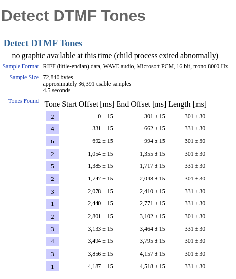
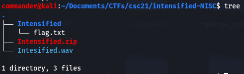
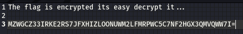
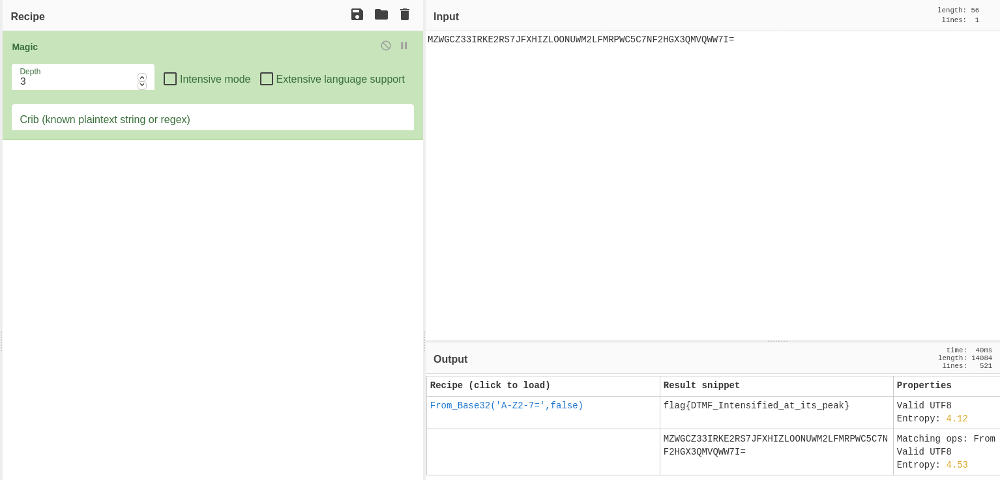
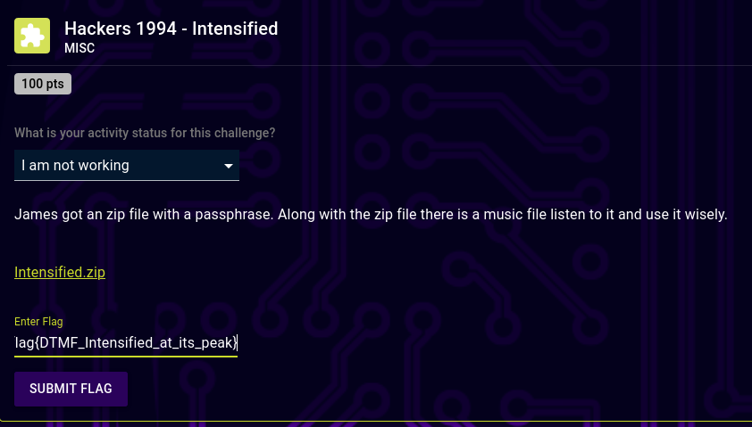

# Hackers1994-Intensified (misc) 100 Points 

## Description

James got an zip file with a passphrase. Along with the zip file there is a music file listen to it and use it wisely.

## Resources

[Provided files]()

## Solution

I download the files and i am given .wav audio file and a passowrd protected .zip archive.

Firslty, i listen to the audio file and it is just a bunch of dial tones from an old phone. Since the tones are audile i know an online website that will automatically detect DTMF tones from and audio file you upload.
>http://dialabc.com/sound/detect/index.html

I feed the audio file and get the following output
>2462523123431

The output is the password to the zip archive. Extracting it's contents i find a file called flag.txt

Flag.txt contains some instructions and an excrypted string. 

I pasted the string into cyberchef and set the recipe to "magic" and click intensive mode at depth 3. Magic reveals the decrypted flag. Magic reveals the encyption as Base32 using "A-Z2-7=" which is the default option when selecting this. You can replicate this or decrypt manually by deleting the magic recipe and inserting "from base32"
>flag{DTMF_Intensified_at_its_peak}

