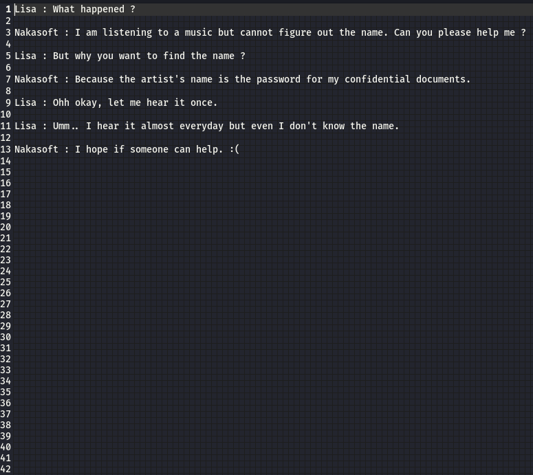
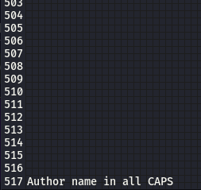
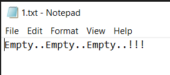

# Matrix1999-C00rupt3d(steganography) 

## Description

100 points

You'll need to dig deep to find this one

## Resources

[Provided files](https://github.com/FidgetCube/CTF_writeups/blob/main/2021-CyberSkillsChallenge/Matrix1999-C00rupt3d(steganography)/providedFiles)

## Solution

Extract the provided .zip archive to find two files, CallMeX.wav and NOTE.txt. Opening the note there is a conversation between two people, one called Nakasoft which i know makes an old but very effective steganography tool which is fitting for a steganogrpahy challenge. The note points to a hint that the artists name of the .wav file is the password to Lisa's files. I always hit ctrl+a to select all text looking for tone on tone text, whitespace steg or various other techinques that may not be visible to the naked eye and i notice two things. There is a scroll bar on the right hand side showing that we are only looking at a small section of the file, there is also line numbers for the document and they continue off the bottom of the screen. 

I scroll down and find on the bottom line a clue related to the password being in all caps.

Next step was to shazam the song to get the artists name and the arist and song came back to Randall - Wahran.

Now i had to switch to my local windows machine because the Nakasoft steg tool Xiao is Windows only and it is always a great idea to extract hidden data with the same tool that was used to conceal it in the first place. I loaded up the program and pointed to the .wav file. The program isn't super intuitive for first time users but the program displays 3 items in the window that can be extracted from the .wav file, if you know the password. The program however doesn't offer any kind of feedback whether you enter the correct password or not. I entered "RANDALL" in caps as per the clue in the note and extracted the 3 items.

In this case, the fact that the 3 files extract correctly and I can see a thumbnail for a .jpg suggests that i entered the password correctly. If you try to extract the same files with the incorrect password you are likely to either get random data or none at all. 

The text file is a dead end. 

The .bmp wont' open as an image but i opened it in a hex editor to view what data is contained within and i find the flag.

