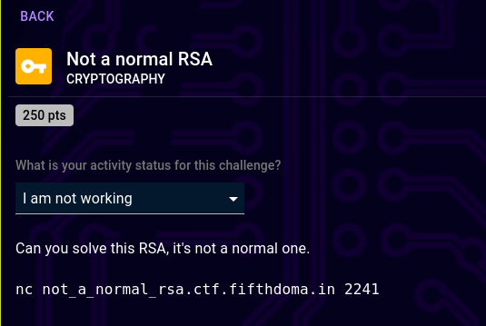
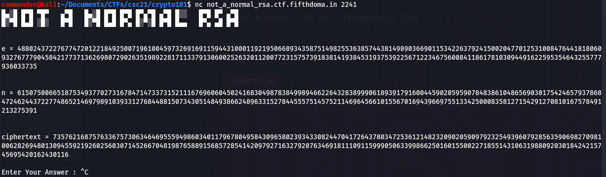
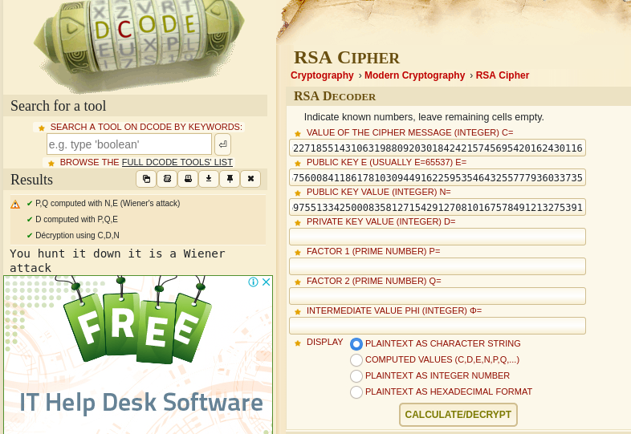
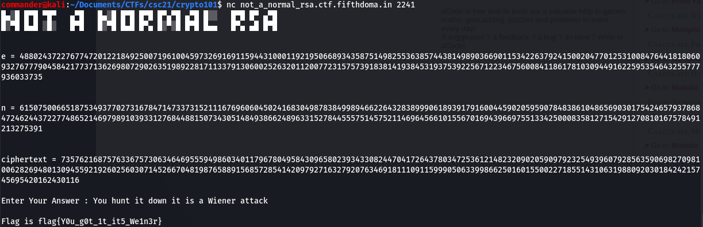
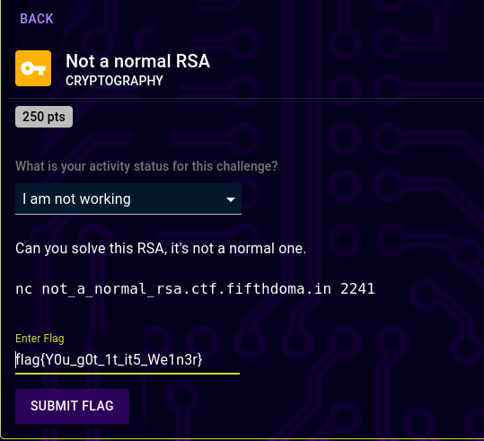

# Not a normal RSA (steganography) 

## Description

250 points  
Can you solve this RSA, it's not a normal one

## Resources

nc not_a_normal_rsa.ctf.fifthdoma.in 2241

## Solution

So the first step is to use the netcat command provided in the description to receive instructions.
>nc not_a_normal_rsa.ctf.fifthdoma.in 2241

Entering the nc command returns the following.

We are provided *n*, *e* and some ciphertext. What we know of RSA and the way it works, we only have 2 approaches here. Ultimately we need to calculate the decryption key *d* from the above so we can decrypt the ciphertext. We either attempt to factor *n* in order to derive *p* and *q* so that we can calculate *d* and decrypt the ciphertext, or we attack *e*. We also know that when a large *e* is used, it implies a small *d*. *e* is commonly 65537 and so we can see that the *e* used in this case is significantly larger and therefore this should be vulnerable to the Weiner attack. There are several ways to achieve this but arguably the simplest is using this website.
>https://www.dcode.fr/rsa-cipher

You can see that *n*, *e* and the ciphertext are provided and the outputted plaintext is on the left. What has happened behind the scenes here is dcode has used the Weiner attack on *e* and derived *d* and decrypted the ciphertext. This string now needs to be sent back as input in nc.
>You hunt it down it is a Weiner attack

Submit flag for profit

