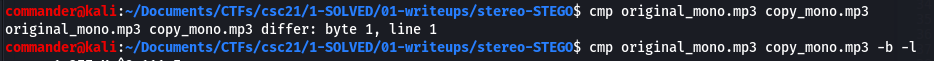
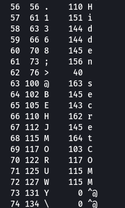
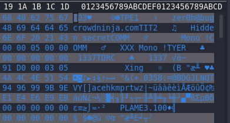
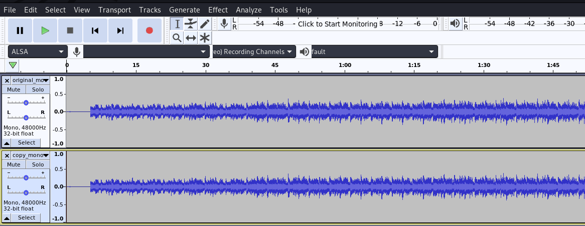
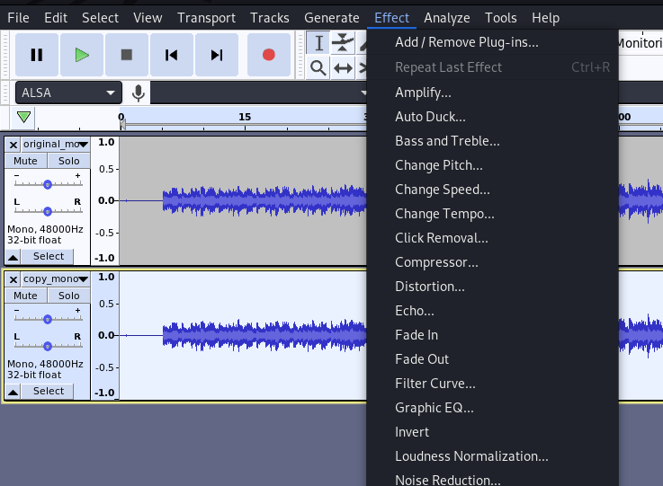
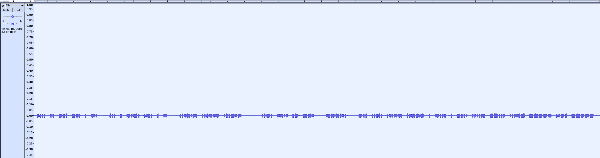
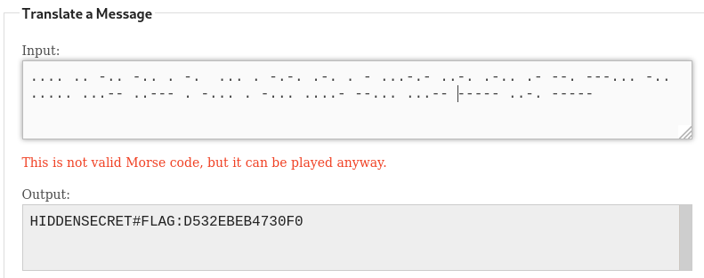
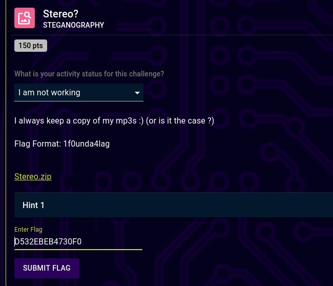

# Stereo? (steganogprahy) 

## Description

150 Points

I always keep a copy of my mp3s :) (or is it the case ?)

## Resources

[Provided files](https://github.com/FidgetCube/CTF_writeups/blob/main/2021-CyberSkillsChallenge/Stereo%3F(steganography)/providedFiles)

## Solution

I was provided a .zip archive containing two .mp3 files, the first called original_mono.mp3 and the second called copy_mono.mp3. 

Immediately this leads me to believe that there will be a slight difference in the files and i will need to identify this to solve the challenge. I tried a few techniques here which gave me a clue that i was on the right path but wasn't enough to solve the challenge. I don't normally talk about methods that don't work but i want to touch on these that i tried.

First i used the cmp command line tool to compare the files byte by byte.
>cmp original_mono.mp3 copy_mono.mp3

Then i choose to print the byte differences out and i pick up a clue. There are the words "Hidden secret" running down the list.
>cmp original_mono.mp3 copy_mono.mp3 -b -l

Next i opened copy_mono.mp3 in a hex editor and saw the same text but it didn't help.

I did a bit of research on the difference between two audio files and came up with a Null Cipher. In short, to decrypt you need an original/unmodified file and when compared, the common parts cancel each other out leaving you with the secret message. Finally i switched to the audio tool Audacity which can be used for almost all kinds of audio steganography.

Here i opened the file original_mono.mp3 in a project in audacity. Then i imported the copy_mono.mp3 into the same project by clicking >File>Import>Audio. I now have the two files side by side.  

It's time to select either track by double clicking on it, either will work, and with only one file selected click >Effect>Invert.

Now i need to add both tracks together so we can sort out the difference between the two. Select all and click >Tracks>Mix>Mix and Render. Only a small amount of sound is remaining the in waveform and if you listen to it, it's morse code. You can stretch the waveform out and see the morse code quite clearly in front of you.

Next i used a great website to type the dots and spaces into and it automatically converts the morse to avoid mistakes doing this by hand and it's quicker.
>https://morsecode.world/international/translator.html

This gives me the following string and all after the colon can be submitted for the points.
>HIDDENSECRET#FLAG:D532EBEB4730F0

