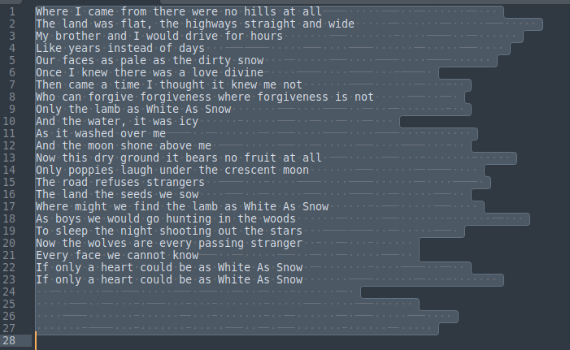
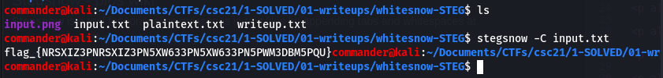

# Whitesnow (Steganography) 

## Description

100 Points

White, snow or maybe both?

## Resources

[Provided file](https://github.com/FidgetCube/CTF_writeups/blob/main/2021-CyberSkillsChallenge/whitesnow(steganpgraphy)/input.txt)

## Solution

Firstly i opened the text file to read the text or see what it contained. Opening with text editor in Kali showed little other than some random sentances. I opened it in Sublime, my favourite, and when i hit ctrl+a for select all, i can see some spaces and tabs highlighted at the end of each sentance. 

a little googling around the name of the challenge with steganography and spaces revealed a technique called "Whitespace Steganography". It is a process of appending tabs and spaces at the end of the lines of text which contain a hidden message. Stegsnow is a tool in linux for detecting and decoding the hidden messages and the usage is pretty simple.

