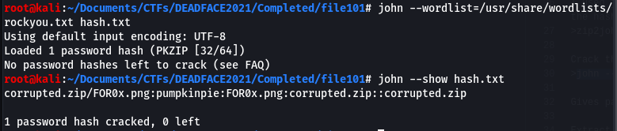

# File101 (forensics) 

## Description

200 points  
An email, containing a photo of pumpkin, was found in an employee's Gmail inbox. The photo looks normal, but looks can be deceiving sometimes. What secrets could it be holding?

## Resources

[Provided image](https://github.com/FidgetCube/CTF_writeups/blob/main/2021-DEADFACE-CTF/File101(forensics)/2311432%40.jpg)  
[Extracted zip archive](https://github.com/FidgetCube/CTF_writeups/blob/main/2021-DEADFACE-CTF/File101(forensics)/corrupted.zip)

## Solution

Provided the following image

Running strings over the image reveals a drop box location 
>"https://www.dropbox.com/s/io1kaqznal2c10y/corrupted.zip?dl=0"

Navigating to the dropbox location downloads a zip archive corrupted.zip which is password protected and contains a .png file.

## Cracking password

I used john to crack the zip password. First step is to extract the password hash from the file using the following command, so we can perform offline cracking on the hash.
>zip2john currupted.zip > hash.txt

Crack the hash using the rockyou wordlist
>john --wordlist=/usr/share/wordlists/rockyou.txt hash.txt

the cracked password is 'pumpkinpie'

Extracting the zip archive gives you an image 'FOR0.png' however, attempting to open the image you get an error that the file is corrupted. So, time to open it up in a hex editor and see whats under the hood. You can see the JFIF in the ASCII view on the right which is part of a JPEG file header. 

rebuild header, rename to JPEG and open

