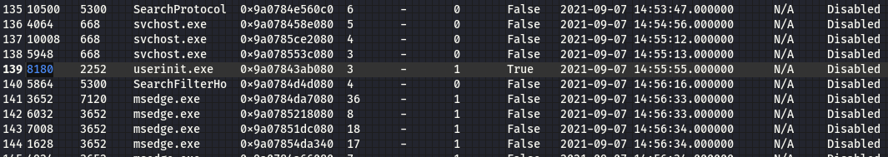
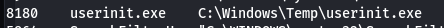

# Window Pains 1-4 (forensics) 

### Description

One of De Monne's employees had their personal Windows computer hacked by a member of DEADFACE. The attacker managed to exploit a portion of a database backup that contains sensitive employee and customer PII.

### Resources

Download File (1.5GB; ~5GB after decompression)  
SHA1: 293c3a2a58ed7b15a8454f6dcd8bec0773ba550e  
Password: d34df4c3  
[Provided file]()
<hr>

# Window Pains 1

### Description

30 points  
Inspect the memory dump and tell us the Windows Major Operating System Version, bit version, and the image date/time (UTC, no spaces or special characters). Submit the flag as flag{OS_BIT_YYYYMMDDhhmmss}.  
Example: flag{WindowsXP_32_202110150900}


### Solution

Download the memory dump and unzip it. I used Volatility3 for these tasks, there are slight differences in volatility2 and volatility3 syntax and plugins.

First command was to use Windows info since the description already told us that it was a Windows Operating System which i verified but will spare you the details.  
>python3 /root/Documents/Tools/volatility3/vol.py -f physmemraw windows.info

This will need to be run with sudo if you aren't logged in as root when performing these steps.
>sudo python3 /root/Documents/Tools/volatility3/vol.py -f physmemraw windows.info
```Volatility 3 Framework 2.0.0
Progress:  100.00		PDB scanning finished                        
Variable	Value

Kernel Base	0xf8005da00000
DTB	0x1aa000
Symbols	file:///root/Documents/Tools/volatility3/volatility3/symbols/windows/ntkrnlmp.pdb/47114209A62F3B9930F6B8998DFD4A99-1.json.xz
Is64Bit	True
IsPAE	False
layer_name	0 WindowsIntel32e
memory_layer	1 FileLayer
KdVersionBlock	0xf8005e60f378
Major/Minor	15.19041
MachineType	34404
KeNumberProcessors	4
SystemTime	2021-09-07 14:57:44
NtSystemRoot	C:\WINDOWS
NtProductType	NtProductWinNt
NtMajorVersion	10
NtMinorVersion	0
PE MajorOperatingSystemVersion	10
PE MinorOperatingSystemVersion	0
PE Machine	34404
PE TimeDateStamp	Sat Apr  7 12:04:17 2068```

flag{Windows10_64_20210907145744}

<hr>


# Window Pains 2

### Description

50 points  
Using the memory dump file from Window Pains, submit the victim's computer name.  
Submit the flag as flag{COMPUTER-NAME}.


### Solution

Again using Volatility3 for this one, we are going to access Windows enviroment variables using the envars plugin in order to pull out the computer name.
>python3 vol.py -f /root/Documents/CTFs/DEADFACE2021/memdump/physmemraw windows.envars

This can pull bag hundreds of lines which can be painful to sift through so you can pipe to grep and search for "COMPUTERNAME"
>python3 vol.py -f /root/Documents/CTFs/DEADFACE2021/memdump/physmemraw windows.envars | grep "COMPUTERNAME"

```
568gresswininit.exe	0x2760e6015c0canCOMPUTERNAMEd   DESKTOP-IT8QNRI      
644	winlogon.exe	0x2a6290a15c0	COMPUTERNAME	DESKTOP-IT8QNRI
668	services.exe	0x18faf803120	COMPUTERNAME	DESKTOP-IT8QNRI
708	lsass.exe	0x23442203120	COMPUTERNAME	DESKTOP-IT8QNRI
832	svchost.exe	0x1e39d603300	COMPUTERNAME	DESKTOP-IT8QNRI
--- SNIP ---
```

flag{DESKTOP-IT8QNRI}

<hr>


# Window Pains 3

### Description

100 points  
Using the memory dump file from Window Pains, find out the name of the malicious process.  
Submit the flag as `flag{process-name_pid}` (include the extension).  
Example: `flag{svchost.exe_1234}`   

### Solution

We need to find a malicious process so the first step is to dump the running processes from the memory dump file.
>python3 vol.py -f /root/Documents/CTFs/DEADFACE2021/memdump/physmemraw windows.pslist

Or you can output the results to a text file
>python3 vol.py -f /root/Documents/CTFs/DEADFACE2021/memdump/physmemraw windows.pslist > /root/Documents/CTFs/DEADFACE2021/memdump/pslist.txt

The hard part is being able to identify which process is the malicious process. It can take a lot of googling and learning what are normal processes etc. 
In this case, one way of narrowing down the process to investigate was using the column Wow64 which is short for Windows 32-bit on Windows 64-bit. This Windows feature allows 32-bit applications to run on 64-bit Windows installations. Like every piece of convenience though, hackers can leverage this functionality for malicious purposes. Malware authors use a technique known as "Heaven's Gate" which bypasses some of the execution flow of the Wow64 functionality so despite it being a perfectly intended feature, sometimes you can start by looking at which processes in the list have utilised it and explore their parent process for legitimacy. As you can see below, the process *userinit.exe* with process ID 8180 is suspicious.

```
Volatility 3 Framework 2.0.0

PID	    PPID	ImageFileName	Offset(V)	Threads	Handles	SessionId	Wow64	CreateTime	ExitTime	    File output

--- snip ---
10500	5300	SearchProtocol	0x9a0784e560c0	6	  -     	0      	False	2021-09-07 14:53:47.000000 	N/A	Disabled
4064	668	    svchost.exe	    0x9a078458e080	5	  -         0	    False	2021-09-07 14:54:56.000000 	N/A	Disabled
10008	668	    svchost.exe	    0x9a0785ce2080	4	  - 	    0       False	2021-09-07 14:55:12.000000 	N/A	Disabled
5948	668	    svchost.exe	    0x9a078553c080	3	  - 	    0       False	2021-09-07 14:55:13.000000 	N/A	Disabled
8180	2252	userinit.exe	0x9a07843ab080	3	  - 	    1       True	2021-09-07 14:55:55.000000 	N/A	Disabled
5864	5300	SearchFilterHo	0x9a0784d4d080	4	  - 	    0       False	2021-09-07 14:56:16.000000 	N/A	Disabled
3652	7120	msedge.exe	    0x9a0784da7080	36	  - 	    1       False	2021-09-07 14:56:33.000000 	N/A	Disabled
6032	3652	msedge.exe	    0x9a0785218080	8	  - 	    1       False	2021-09-07 14:56:33.000000 	N/A	Disabled
7008	3652	msedge.exe	    0x9a07851dc080	18	  - 	    1       False	2021-09-07 14:56:34.000000 	N/A	Disabled
--- snip ---
```
<p align="center"></p>

Lets look at the cmdline plugin and see what we can get for PID 8180
>python3 /root/Documents/Tools/volatility3/vol.py -f physmemraw windows.cmdline | grep 8180

```
8180 userinit.exe	C:\Windows\Temp\userinit.exe
```

userinit.exe running from \Temp folder is quite strange.
<p align="center"></p>

*userinit.exe* in general is a legitimate process so a little more digging might help here. Netscan shows network artifacts and we can see an established connection on port 37349 for PID 8180 which is definitely not conventional.
>python3 /root/Documents/Tools/volatility3/vol.py -f physmemraw netscan | grep ESTA  | grep -v msedge

```
0x9a077f743a20.0TCPv4	10.65.201.2 scan51673fin204.79.197.254  443     ESTABLISHED	5780	SearchApp.exe	2021-09-07 14:57:00.000000 
0x9a07808bb010	TCPv4	10.65.201.2	58489	131.253.33.254	    443	    ESTABLISHED	5780	SearchApp.exe	2021-09-07 14:57:08.000000 
0x9a0780c36050	TCPv4	10.65.201.2	63247	131.253.33.254	    443	    ESTABLISHED	5780	SearchApp.exe	2021-09-07 14:57:06.000000 
0x9a0780e9aa20	TCPv4	10.65.201.2	59110	13.107.21.200	    443   	ESTABLISHED	5780	SearchApp.exe	2021-09-07 14:56:37.000000 
0x9a078424ca20	TCPv4	10.65.201.2	54116	13.107.18.254	    443 	ESTABLISHED	5780	SearchApp.exe	2021-09-07 14:57:03.000000 
0x9a07845134e0	TCPv4	10.65.201.2	62312	13.107.43.14	    443 	ESTABLISHED	5780	SearchApp.exe	2021-09-07 14:57:12.000000 
0x9a078475ea20	TCPv4	10.65.201.2	54557	204.79.197.254	    443 	ESTABLISHED	5780	SearchApp.exe	2021-09-07 14:57:02.000000 
0x9a0784a38010	TCPv4	10.65.201.2	65194	13.107.3.254	    443 	ESTABLISHED	5780	SearchApp.exe	2021-09-07 14:57:09.000000 
0x9a0784a384a0	TCPv4	10.65.201.2	62310	131.253.33.254	    443 	ESTABLISHED	5780	SearchApp.exe	2021-09-07 14:57:11.000000 
0x9a0784d484a0	TCPv4	10.65.201.2	58487	13.107.6.156	    443 	ESTABLISHED	992 	WWAHost.exe 	2021-09-07 14:57:08.000000 
0x9a0784dc88a0	TCPv4	10.65.201.2	58957	173.223.109.223	    443 	ESTABLISHED	992 	WWAHost.exe 	2021-09-07 14:57:17.000000 
0x9a0784f18270	TCPv4	10.65.201.2	5432	10.65.201.144	    37349	ESTABLISHED	8180	userinit.exe	2021-09-07 14:57:25.000000 
0x9a078515f010	TCPv4	10.65.201.2	59165	20.50.201.200	    443 	ESTABLISHED	992 	WWAHost.exe 	2021-09-07 14:57:45.000000 
0x9a0785198050	TCPv4	10.65.201.2	65193	131.253.33.254	    443 	ESTABLISHED	5780	SearchApp.exe	2021-09-07 14:57:08.000000 
0x9a07851aa010	TCPv4	10.65.201.2	51706	13.64.180.106	    443 	ESTABLISHED	2104	svchost.exe 	2021-09-07 14:29:58.000000 
0x9a07851b1010	TCPv4	10.65.201.2	58488	13.107.6.156	    443 	ESTABLISHED	992 	WWAHost.exe 	2021-09-07 14:57:08.000000 
0x9a07852264a0	TCPv4	10.65.201.2	62314	131.253.33.254	    443 	ESTABLISHED	5780	SearchApp.exe	2021-09-07 14:57:13.000000 
0x9a078543e010	TCPv4	10.65.201.2	55339	20.54.24.169	    443 	ESTABLISHED	7584	svchost.exe 	2021-09-07 14:57:37.000000
--- snip ---
```

Lets look at the process tree to see if there are duplicates and have a look at the parent processes to try and determine what spawned this.
>python3 /root/Documents/Tools/volatility3/vol.py -f physmemraw windows.pstree

```
PID	PPID	    ImageFileName	Offset(V)	Threads	Handles	SessionId	Wow64	CreateTime	ExitTime
644	536	        winlogon.exe	0x9a077fe9c140	3   	-   	1   	False	2021-09-07 14:24:54.000000 	N/A
* 856	644	    fontdrvhost.ex	0x9a077ff89140	5   	-   	1   	False	2021-09-07 14:24:55.000000 	N/A
* 428	644	    dwm.exe	        0x9a078087f080	21  	-    	1   	False	2021-09-07 14:24:56.000000 	N/A
* 384	644	    LogonUI.exe	    0x9a078087e080	0   	-   	1   	False	2021-09-07 14:24:56.000000 	2021-09-07 14:25:29.000000 
* 4140	644	    userinit.exe	0x9a07849b5080	0   	-   	1   	False	2021-09-07 14:25:12.000000 	2021-09-07 14:25:36.000000 
** 4012	4140	explorer.exe	0x9a07849b7340	71  	-   	1   	False	2021-09-07 14:25:12.000000 	N/A
```

As you can see here there is another process called *userinit.exe* with a much lower PID. Lower PIDs can mean that they are among the first processes spawned when a computer is started and are generally essential for the computer to run before the user has a chance to spawn any through their actions. This *userinit.exe* was spawned by PID644 which is *winlogon.exe* and has not utilised Wow64 so safe to say this is the legitimate one and PID 8180 is the malicious process.

### flag{userinit.exe_8180}

<hr>

# Window Pains 4

### Description

200 points  
We want to see if any other machines are infected with this malware. Using the memory dump file from Window Pains, submit the SHA1 checksum of the malicious process.  
Submit the flag as flag{SHA1 hash}.  
CAUTION: Practice good cyber hygiene! Use an isolated VM to download/run the malicious process. While the malicious process is relatively benign, if you're using an insecurely-configured Windows host, it may be possible for someone to compromise your machine if they can reach you on the same network.

### Solution

We know the malicious process from the previous task, now we just need to dump the malicious process and hash it. This command dumps PID 8180 to *pid.8180.0x400000.dmp*. 
>python3 /root/Documents/Tools/volatility3/vol.py -f physmemraw windows.pslist --pid 8180 --dump

```
Volatility 3 Framework 2.0.0
Progress:  100.00		PDB scanning finished                        
PID	PPID	ImageFileName	Offset(V)	Threads	Handles	SessionId	Wow64	CreateTime	ExitTime	File output

8180	2252	userinit.exe	0x9a07843ab080	3	-	1	True	2021-09-07 14:55:55.000000 	N/A	pid.8180.0x400000.dmp
```

Generate the SHA1 hash
>sha1sum pid.8180.0x400000.dmp

```
f1fed7aca78502c041dba20e63e2e3fde07d0777  pid.8180.0x400000.dmp
```

### flag{f1fed7aca78502c041dba20e63e2e3fde07d0777}
