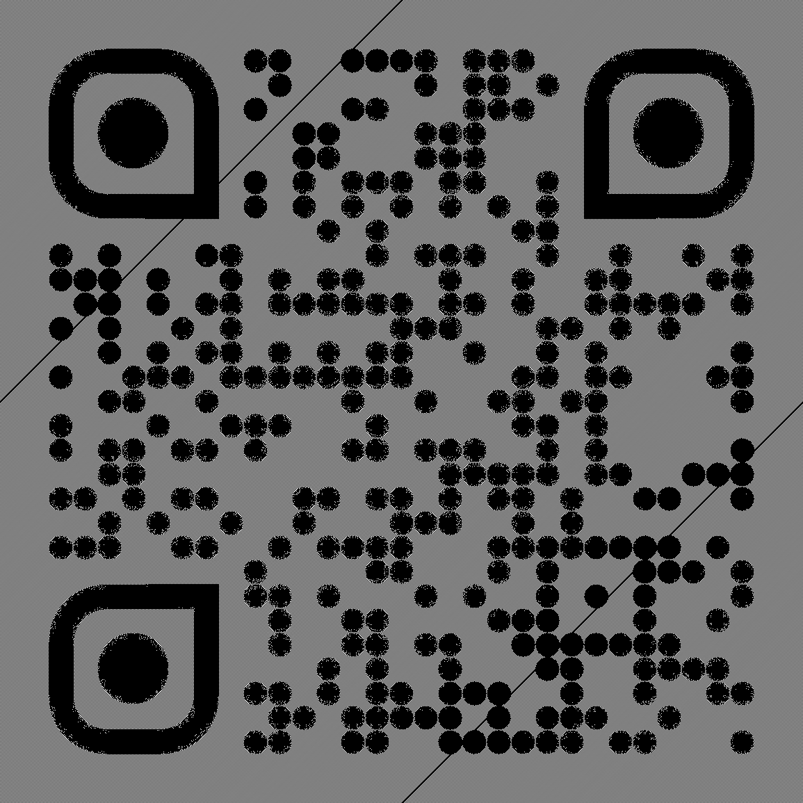

# Mission Hotel- H4 StegSnow (Steganography) 

## Resources

The file size for this challenge was over 70MB and therefore is too large to be uploaded here.

## Solution

Download the image and run file which shows it as a valid .jpg and over 72 MB in size.

Lets find out what is making the image this size. Open it in a hex editor and search for the header (0xFFD8) and footer (0xFFD9) to see if there is any extra data out of place. There should be nothing after the footer as that signifies the end of the image. We can see there is a lot of data after the footer.

Time to cut that extra data out and save it into a separate file, then we can try and identify what it is and what to do with it. The extra data turned out to be over 70MB of these weird number sequences repeated.

>(1.973694276711756856e+03+6.051639915029231815e+03j), (1.449012052875320842e+04-9.359865272916873437e+03j), 
>(-3.963687854299552782e+03-1.579055054557548829e+03j), (-1.595380755651327718e+02+8.798302406418617466e+03j), 
>(6.669960222240782969e+03-6.114536070708731131e+03j), (-1.497707556949169430e+03-5.865963245464587089e+03j), 
>(-2.394255645262285270e+03+9.393607533138980216e+03j), (-1.813278181627972117e+03+8.427070015803757997e+03j), 
>(6.120954966416011302e+03+2.741969898388250840e+03j), (6.426078877700606427e+02+1.338965982282841196e+02j), 
>(-8.814912071222021041e+03-2.776788579671653224e+03j), (-2.760585235990283309e+03-1.955541728425359224e+03j), 
>(8.803680230064711623e+02-4.029748541614612805e+02j), (-3.195501919189532600e+03-6.725542061819614901e+03j), 
>(2.127361234349085407e+03+4.407263279901763781e+03j), (-2.639510940775000563e+03+2.500663513278394021e+03j), 
>(1.348690182249325699e+04-1.263048984730932716e+03j), (-1.687968172076358769e+03-1.968869455553277703e+03j), 
>(-2.008537456156048620e+03-6.094603101331699690e+01j), (-4.228876299366038438e+03-3.260336606184530865e+03j), 
>(1.257077511100539141e+03-2.771806447551471706e+02j), (2.900101521775442961e+03+2.288139008812128395e+03j), 
>(-2.246784516619854003e+03+1.494979014498743027e+03j), (2.643530360989742576e+02-1.703736466431772214e+03j),

A little googling suggests these are complex numbers and require a Fourier Transform to be conducted in order to process these numbers as an image. I had a friend share his [python code here](https://github.com/FidgetCube/CTF_writeups/blob/main/2022-CyberSkillsChallenge/H4-StegSnow/complex_solver.ipynb) that conducted the transform. In order to run this script i saved the complex numbers into a file called wackfile.csv so it could be read and parsed by the python script. Once the code runs, a QR code is printed to the screen

Scanning the QR code takes you to a [pastebin page](https://pastebin.com/eF2DBZ5a) with a large blob of base64 encoded text.

>QWNjb3JkaW5nIHRvIGFsbCBrbm93biBsYXdzCSAgCSAgICAJIAkgCSAgIAkgICAgCm9mIGF2aWF0
aW9uLAkgICAgCSAgCSAgICAJICAgCSAgICAgICAJICAgICAJICAgICAJICAgCiAgICAgICAJICAg
IAkgCQkgICAgICAgCSAgICAgIAkgICAgIAkgICAgICAJICAgICAgIAkgICAgCiAgICAgCSAgIAkg
ICAJIAkJICAgCSAgICAJICAgIAkgICAgIAkgIAp0aGVyZSBpcyBubyB3YXkgYSBiZWUgICAgIAkg
ICAgICAgCSAgICAgCSAgICAgCSAgICAJICAgIAkgICAgIApzaG91bGQgYmUgYWJsZSB0byBmbHku
ICAJICAgICAJICAgICAgIAkgCSAgIAkgICAgICAgCSAgICAgIAogCSAJICAgICAgCQkgICAgIAkg
CSAgICAgIAkgICAgICAJICAJICAgCiAgICAgICAJIAkgICAgIAkgICAgICAgCSAgICAgCkl0cyB3
aW5ncyBhcmUgdG9vIHNtYWxsIHRvIGdldAppdHMgZmF0IGxpdHRsZSBib2R5IG9mZiB0aGUgZ3Jv
dW5kLgoKClRoZSBiZWUsIG9mIGNvdXJzZSwgZmxpZXMgYW55d2F5CgoKYmVjYXVzZSBiZWVzIGRv
bid0IGNhcmUKd2hhdCBodW1hbnMgdGhpbmsgaXMgaW1wb3NzaWJsZS4KCgpZZWxsb3csIGJsYWNr
LiBZZWxsb3csIGJsYWNrLgpZZWxsb3csIGJsYWNrLiBZZWxsb3csIGJsYWNrLgoKCk9vaCwgYmxh
Y2sgYW5kIHllbGxvdyEKTGV0J3Mgc2hha2UgaXQgdXAgYSBsaXR0bGUuCgoKQmFycnkhIEJyZWFr
ZmFzdCBpcyByZWFkeSEKCgpPb21pbmchCgoKSGFuZyBvbiBhIHNlY29uZC4KCgpIZWxsbz8KCgot
IEJhcnJ5PwotIEFkYW0/CgoKLSBPYW4geW91IGJlbGlldmUgdGhpcyBpcyBoYXBwZW5pbmc/Ci0g
SSBjYW4ndC4gSSdsbCBwaWNrIHlvdSB1cC4KCgpMb29raW5nIHNoYXJwLgoKClVzZSB0aGUgc3Rh
aXJzLiBZb3VyIGZhdGhlcgpwYWlkIGdvb2QgbW9uZXkgZm9yIHRob3NlLgoKClNvcnJ5LiBJJ20g
ZXhjaXRlZC4KCgpIZXJlJ3MgdGhlIGdyYWR1YXRlLgpXZSdyZSB2ZXJ5IHByb3VkIG9mIHlvdSwg
c29uLgoKCkEgcGVyZmVjdCByZXBvcnQgY2FyZCwgYWxsIEIncy4KCgpWZXJ5IHByb3VkLgoKCk1h
ISBJIGdvdCBhIHRoaW5nIGdvaW5nIGhlcmUuCgoKLSBZb3UgZ290IGxpbnQgb24geW91ciBmdXp6
LgotIE93ISBUaGF0J3MgbWUhCgoKLSBXYXZlIHRvIHVzISBXZSdsbCBiZSBpbiByb3cgMTE4LDAw
MC4KLSBCeWUhCgoKQmFycnksIEkgdG9sZCB5b3UsCnN0b3AgZmx5aW5nIGluIHRoZSBob3VzZSEK
CgotIEhleSwgQWRhbS4KLSBIZXksIEJhcnJ5LgoKCi0gSXMgdGhhdCBmdXp6IGdlbD8KLSBBIGxp
dHRsZS4gU3BlY2lhbCBkYXksIGdyYWR1YXRpb24uCgoKTmV2ZXIgdGhvdWdodCBJJ2QgbWFrZSBp
dC4KCgpUaHJlZSBkYXlzIGdyYWRlIHNjaG9vbCwKdGhyZWUgZGF5cyBoaWdoIHNjaG9vbC4KCgpU
aG9zZSB3ZXJlIGF3a3dhcmQuCgoKVGhyZWUgZGF5cyBjb2xsZWdlLiBJJ20gZ2xhZCBJIHRvb2sK
YSBkYXkgYW5kIGhpdGNoaGlrZWQgYXJvdW5kIHRoZSBoaXZlLgoKCllvdSBkaWQgY29tZSBiYWNr
IGRpZmZlcmVudC4KCgotIEhpLCBCYXJyeS4KLSBBcnRpZSwgZ3Jvd2luZyBhIG11c3RhY2hlPyBM
b29rcyBnb29kLgoKCi0gSGVhciBhYm91dCBGcmFua2llPwotIFllYWguCgoKLSBZb3UgZ29pbmcg
dG8gdGhlIGZ1bmVyYWw/Ci0gTm8sIEknbSBub3QgZ29pbmcuCgoKRXZlcnlib2R5IGtub3dzLApz
dGluZyBzb21lb25lLCB5b3UgZGllLgoKCkRvbid0IHdhc3RlIGl0IG9uIGEgc3F1aXJyZWwuClN1
Y2ggYSBob3RoZWFkLgoKCkkgZ3Vlc3MgaGUgY291bGQgaGF2ZQpqdXN0IGdvdHRlbiBvdXQgb2Yg
dGhlIHdheS4KCgpJIGxvdmUgdGhpcyBpbmNvcnBvcmF0aW5nCmFuIGFtdXNlbWVudCBwYXJrIGlu
dG8gb3VyIGRheS4KCgpUaGF0J3Mgd2h5IHdlIGRvbid0IG5lZWQgdmFjYXRpb25zLgoKCkJveSwg
cXVpdGUgYSBiaXQgb2YgcG9tcC4uLgp1bmRlciB0aGUgY2lyY3Vtc3RhbmNlcy4KCgotIFdlbGws
IEFkYW0sIHRvZGF5IHdlIGFyZSBtZW4uCi0gV2UgYXJlIQoKCi0gQmVlLW1lbi4KLSBBbWVuIQoK
CkhhbGxlbHVqYWghCg==

Copying this text into cyberchef and adding base64 decode recipe, reveals a body of english text with no flag anywhere in the text. There is however, some odd spacing and the challenge name does reveal a clue about the steganography technique called Stegsnow that uses whitespaces to conceal messgaes. 

Copy the text out and paste into sublime where when you select all, you can see the whitespace code. 

Save the text to a file and pass it to stegsnow for the flag.

## FLAG{w0w_7h15_i5_7r1cky}
