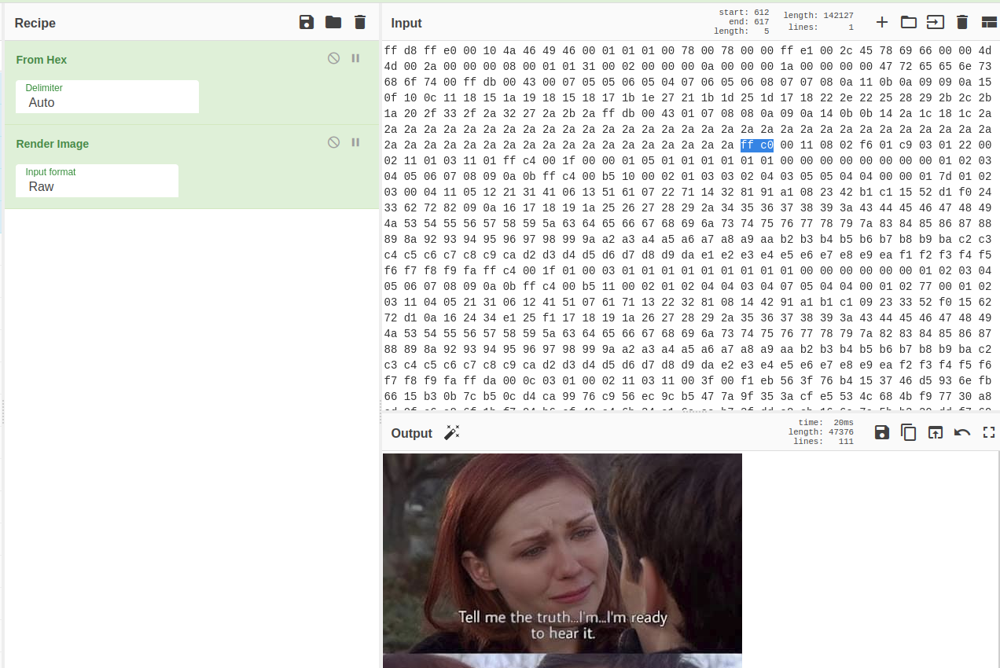
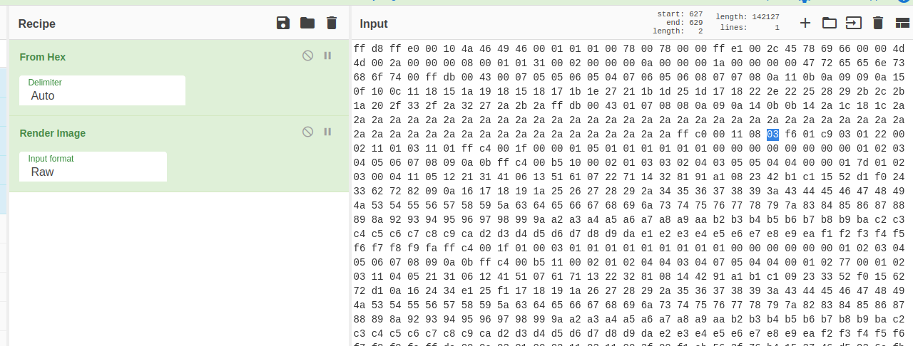

# Keep Your Secrets (Steganography) 

## Description

275 points  

## Resources

[Provided file](https://github.com/FidgetCube/CTF_writeups/blob/main/2022-DeadFace-CTF/KeepYourSecrets(Steganography)/keepyoursecrets.jpg)

## Solution

Open the image to see if anything immediately stands out.

First thing i did was upload the image to https://www.aperisolve.com/ which is one of the best online stego tools. 

Apersolve suggests there is extraneous bytes before the End Of File(EOF) marker "0xd9". So i want to adjust the images borders and see if i can reveal some more data. I navigate to https://gchq.github.io/CyberChef/ and drag the image into the input box in the top right corner. In the recipe section in the middle select "from hex" first and then "render image", these settings will display the image in the output section. So i am going to edit the parameters in the input section and watch what happens to the image in the output as i make changes. 

Search for the bytes "ff c0" which is a Start Of Frame (SOF) marker for most common .jpg images and contains the width and height of the image. See the table below for all .jpg image markers

Now count 4 bytes from the SOF marker and you should see the value "02 f6", the 4th and 5th bytes are the height marker (Y axis). We are going to increment the 4th byte value by 1, from "02" to "03" in order to increase the height of the image.

Because of the receipe in the middle, you should see an immediate change to the rendered image in the output box on the bottom right and #profit

## flag{sup3rsecr3tPasswoRD!}

### The JPEG Start-Of-Frame (SOF) marker has 4 possible values:

>FFC0 (baseline) - This is the usual mode chosen for photos and encodes fully specified DCT blocks in groupings depending on the color/subsample options chosen  
>FFC1 (extended) - This is similar to baseline, but has more than 8-bits per color stimulus  
>FFC2 (progressive) - This mode is often found on web pages to allow the image to load progressively as the data is received. Each "scan" of the image progressively defines more coefficients of the DCT blocks until they're fully defined. This effectively provides more and more detail as more scans are decoded  
>FFC3 (lossless) - This mode uses a simple Huffman encoding to losslessly encode the image. The only place I've seen this used is on 16-bit grayscale DICOM medical images  

### The bytes in a SOF (0xffc0) marker

<TABLE cellSpacing=0 cellPadding=0 width="100%" border=0>
  <TBODY>
  <TR>
    <TD vAlign=top width="100%">the first two bytes, the length, after the marker indicate the number of bytes, including the two length bytes,         that this header contains</TD></TR>
  <TR>
    <TD vAlign=top width="100%">P -- one byte: sample precision in bits (usually 8, for baseline JPEG)</TD></TR>
  <TR>
    <TD vAlign=top width="100%">Y -- two bytes (Height)</TD></TR>
  <TR>
    <TD vAlign=top width="100%">X -- two bytes (Width)</TD></TR>
  <TR>
    <TD vAlign=top width="100%">Nf -- one byte: the number of components in the image 
      <TABLE cellSpacing=0 cellPadding=0 width="100%" border=0>
        <TBODY>
        <TR>
          <TD vAlign=top width="100%">3 for color baseline JPEG images</TD></TR>
        <TR>
          <TD vAlign=top width="100%">1 for grayscale baseline JPEG images</TD></TR>
        </TBODY>
      </TABLE>
    </TD>
  </TR>
  <TR>
    <TD vAlign=top width="100%">Nf times: 
      <TABLE cellSpacing=0 cellPadding=0 width="100%" border=0>
        <TBODY>
        <TR>
          <TD vAlign=top width="100%">Component ID -- one byte</TD></TR>
        <TR>
          <TD vAlign=top width="100%">H and V sampling factors -- one byte: H is first four bits and V is second four bits</TD></TR>
        <TR>
          <TD vAlign=top width="100%">Quantization table number-- one byte</TD></TR>
        </TBODY>
      </TABLE>
    </TD>
  </TR>    
  </TBODY>
</TABLE>

The H and V sampling factors dictate the final size of the component they are associated with. For instance, the color space defaults to YCbCr and the H and V sampling factors for each component, Y, Cb, and Cr, default to 2, 1, and 1, respectively (2 for both H and V of the Y component, etc.) in the Jpeg-6a library by the Independent Jpeg Group. While this does mean that the Y component will be twice the size of the other two components--giving it a higher resolution, the lower resolution components are quartered in size during compression in order to achieve this difference. Thus, the Cb and Cr components must be quadrupled in size during decompression.

Reference: https://www.geocities.ws/crestwoodsdd/JPEG.htm

### JPG Image Markers

<table class="tbl_stats">
<tbody>
<tr>
<th>Hex</th>
<th>Marker</th>
<th>Marker Name</th>
<th>Description</th>
</tr>
<tr>
<td>0x FFC0</td>
<td>SOF0</td>
<td>Start of Frame 0</td>
<td>Baseline DCT</td>
</tr>
<tr>
<td>0x FFC1</td>
<td>SOF1</td>
<td>Start of Frame 1</td>
<td>Extended Sequential DCT</td>
</tr>
<tr>
<td>0x FFC2</td>
<td>SOF2</td>
<td>Start of Frame 2</td>
<td>Progressive DCT</td>
</tr>
<tr>
<td>0x FFC3</td>
<td>SOF3</td>
<td>Start of Frame 3</td>
<td>Lossless (sequential)</td>
</tr>
<tr>
<td>0x FFC4</td>
<td>DHT</td>
<td>Define Huffman Table</td>
<td></td>
</tr>
<tr>
<td>0x FFC5</td>
<td>SOF5</td>
<td>Start of Frame 5</td>
<td>Differential sequential DCT</td>
</tr>
<tr>
<td>0x FFC6</td>
<td>SOF6</td>
<td>Start of Frame 6</td>
<td>Differential progressive DCT</td>
</tr>
<tr>
<td>0x FFC7</td>
<td>SOF7</td>
<td>Start of Frame 7</td>
<td>Differential lossless (sequential)</td>
</tr>
<tr>
<td>0x FFC8</td>
<td>JPG</td>
<td>JPEG Extensions</td>
<td></td>
</tr>
<tr>
<td>0x FFC9</td>
<td>SOF9</td>
<td>Start of Frame 9</td>
<td>Extended sequential DCT, Arithmetic coding</td>
</tr>
<tr>
<td>0x FFCA</td>
<td>SOF10</td>
<td>Start of Frame 10</td>
<td>Progressive DCT, Arithmetic coding</td>
</tr>
<tr>
<td>0x FFCB</td>
<td>SOF11</td>
<td>Start of Frame 11</td>
<td>Lossless (sequential), Arithmetic coding</td>
</tr>
<tr>
<td>0x FFCC</td>
<td>DAC</td>
<td>Define Arithmetic Coding</td>
<td></td>
</tr>
<tr>
<td>0x FFCD</td>
<td>SOF13</td>
<td>Start of Frame 13</td>
<td>Differential sequential DCT, Arithmetic coding</td>
</tr>
<tr>
<td>0x FFCE</td>
<td>SOF14</td>
<td>Start of Frame 14</td>
<td>Differential progressive DCT, Arithmetic coding</td>
</tr>
<tr>
<td>0x FFCF</td>
<td>SOF15</td>
<td>Start of Frame 15</td>
<td>Differential lossless (sequential), Arithmetic coding</td>
</tr>
<tr>
<td>0x FFD0</td>
<td>RST0</td>
<td>Restart Marker 0</td>
<td></td>
</tr>
<tr>
<td>0x FFD1</td>
<td>RST1</td>
<td>Restart Marker 1</td>
<td></td>
</tr>
<tr>
<td>0x FFD2</td>
<td>RST2</td>
<td>Restart Marker 2</td>
<td></td>
</tr>
<tr>
<td>0x FFD3</td>
<td>RST3</td>
<td>Restart Marker 3</td>
<td></td>
</tr>
<tr>
<td>0x FFD4</td>
<td>RST4</td>
<td>Restart Marker 4</td>
<td></td>
</tr>
<tr>
<td>0x FFD5</td>
<td>RST5</td>
<td>Restart Marker 5</td>
<td></td>
</tr>
<tr>
<td>0x FFD6</td>
<td>RST6</td>
<td>Restart Marker 6</td>
<td></td>
</tr>
<tr>
<td>0x FFD7</td>
<td>RST7</td>
<td>Restart Marker 7</td>
<td></td>
</tr>
<tr>
<td>0x FFD8</td>
<td>SOI</td>
<td>Start of Image</td>
<td></td>
</tr>
<tr>
<td>0x FFD9</td>
<td>EOI</td>
<td>End of Image</td>
<td></td>
</tr>
<tr>
<td>0x FFDA</td>
<td>SOS</td>
<td>Start of Scan</td>
<td></td>
</tr>
<tr>
<td>0x FFDB</td>
<td>DQT</td>
<td>Define Quantization Table</td>
<td></td>
</tr>
<tr>
<td>0x FFDC</td>
<td>DNL</td>
<td>Define Number of Lines</td>
<td>(Not common)</td>
</tr>
<tr>
<td>0x FFDD</td>
<td>DRI</td>
<td>Define Restart Interval</td>
<td></td>
</tr>
<tr>
<td>0x FFDE</td>
<td>DHP</td>
<td>Define Hierarchical Progression</td>
<td>(Not common)</td>
</tr>
<tr>
<td>0x FFDF</td>
<td>EXP</td>
<td>Expand Reference Component</td>
<td>(Not common)</td>
</tr>
<tr>
<td>0x FFE0</td>
<td>APP0</td>
<td>Application Segment 0</td>
<td>JFIF &#8211; JFIF JPEG image 
AVI1 &#8211; Motion JPEG (MJPG)</td>
</tr>
<tr>
<td>0x FFE1</td>
<td>APP1</td>
<td>Application Segment 1</td>
<td>EXIF Metadata, TIFF IFD format, 
JPEG Thumbnail (160&#215;120) 
Adobe XMP</td>
</tr>
<tr>
<td>0x FFE2</td>
<td>APP2</td>
<td>Application Segment 2</td>
<td>ICC color profile, 
FlashPix</td>
</tr>
<tr>
<td>0x FFE3</td>
<td>APP3</td>
<td>Application Segment 3</td>
<td>(Not common) 
JPS Tag for Stereoscopic JPEG images</td>
</tr>
<tr>
<td>0x FFE4</td>
<td>APP4</td>
<td>Application Segment 4</td>
<td>(Not common)</td>
</tr>
<tr>
<td>0x FFE5</td>
<td>APP5</td>
<td>Application Segment 5</td>
<td>(Not common)</td>
</tr>
<tr>
<td>0x FFE6</td>
<td>APP6</td>
<td>Application Segment 6</td>
<td>(Not common) 
NITF Lossles profile</td>
</tr>
<tr>
<td>0x FFE7</td>
<td>APP7</td>
<td>Application Segment 7</td>
<td>(Not common)</td>
</tr>
<tr>
<td>0x FFE8</td>
<td>APP8</td>
<td>Application Segment 8</td>
<td>(Not common)</td>
</tr>
<tr>
<td>0x FFE9</td>
<td>APP9</td>
<td>Application Segment 9</td>
<td>(Not common)</td>
</tr>
<tr>
<td>0x FFEA</td>
<td>APP10</td>
<td>Application Segment 10 
PhoTags</td>
<td>(Not common) 
ActiveObject (multimedia messages / captions)</td>
</tr>
<tr>
<td>0x FFEB</td>
<td>APP11</td>
<td>Application Segment 11</td>
<td>(Not common) 
HELIOS JPEG Resources (OPI Postscript)</td>
</tr>
<tr>
<td>0x FFEC</td>
<td>APP12</td>
<td>Application Segment 12</td>
<td>Picture Info (older digicams), 
Photoshop Save for Web: Ducky</td>
</tr>
<tr>
<td>0x FFED</td>
<td>APP13</td>
<td>Application Segment 13</td>
<td>Photoshop Save As: IRB, 8BIM, IPTC</td>
</tr>
<tr>
<td>0x FFEE</td>
<td>APP14</td>
<td>Application Segment 14</td>
<td>(Not common)</td>
</tr>
<tr>
<td>0x FFEF</td>
<td>APP15</td>
<td>Application Segment 15</td>
<td>(Not common)</td>
</tr>
<tr>
<td>0x FFF0 &#8230; 
0x FFF6</td>
<td>JPG6</td>
<td>JPEG Extension 0 &#8230; 
JPEG Extension 6</td>
<td>(Not common)</td>
</tr>
<tr>
<td>0x FFF7</td>
<td>JPG7 
SOF48</td>
<td>JPEG Extension 7 
JPEG-LS</td>
<td>Lossless JPEG</td>
</tr>
<tr>
<td>0x FFF8</td>
<td>JPG8 
LSE</td>
<td>JPEG Extension 8 
JPEG-LS Extension</td>
<td>Lossless JPEG Extension Parameters</td>
</tr>
<tr>
<td>0x FFF9</td>
<td>JPG9</td>
<td>JPEG Extension 9</td>
<td>(Not common)</td>
</tr>
<tr>
<td>0x FFFA</td>
<td>JPG10</td>
<td>JPEG Extension 10</td>
<td>(Not common)</td>
</tr>
<tr>
<td>0x FFFB</td>
<td>JPG11</td>
<td>JPEG Extension 11</td>
<td>(Not common)</td>
</tr>
<tr>
<td>0x FFFC</td>
<td>JPG12</td>
<td>JPEG Extension 12</td>
<td>(Not common)</td>
</tr>
<tr>
<td>0x FFFD</td>
<td>JPG13</td>
<td>JPEG Extension 13</td>
<td>(Not common)</td>
</tr>
<tr>
<td>0x FFFE</td>
<td>COM</td>
<td>Comment</td>
<td></td>
</tr>
</tbody>
</table>

