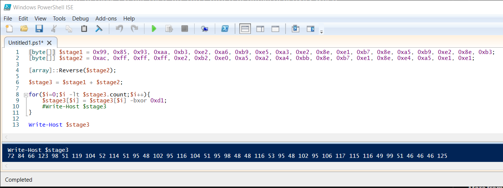

# Puppeteer (Forensics 300 points) 

## Description

## Resources

[Provided files](https://github.com/FidgetCube/CTF_writeups/blob/main/2022-HTBcyberApocalypseCTF/puppeteer(forensics)/forensics_puppeteer.zip)

## Solution

Start by unzipping the provided file and you'll locate a folder called *logs* containing 143 windows event logs (*.evtx). The trick here is going to be how to find the right information quickly. I transfered the log files over to my windows host so i can view the log files in Event Viewer. I started by sorting all the logs by file size to see if any logs were unusally large in size that might indicate extra data.

I opened each of the logs that had a unique file size and did not find anything of value. Then i targeted the powershell log file *Windows PowerShell.evtx* to see if there is any evidence of any scripts running on the system. 

Opening the log in Event Viewer and scrolling through there aren't many entries and you can see there is one entry that stands out. Event ID 800 at 1:40:31AM shows the execution of a powershell script called *special_orders.ps1* from the file path *C:\sysmgr\special_orders.ps1*. The event also logs the user account that ran the script and the command line parameters. 

This doesn't give us much indication that this is a malicious script and so we need to keep looking. There is another windows log pertaining to powershell and usually contains details of executed scripts and you'll see this included in the folder *Microsoft-Windows-PowerShell%4Operational.evtx*.

You can see many more events in this log and of note are the Event ID 4104 events which are execution of a remote command. At 1:43:51AM you can see some registration of new tasks that include the task names of "Elevate Powers" to "Steal weapons" and a second task to "Sabotage Miyuki" to "Bypass Arms Embargo". Both tasks are set to trigger daily at 3PM. We have definitely found the malicious activity but no flag here yet. 

We noted above in the other powershell log that there was a script execute called special_orders.ps1 at 1:40:31AM and there is also an Event ID 4104 at that time.

This shows the complete script that is executed, of note are the variables called $stage1 and $stage2. You can see further down that $stage2 is reversed and the joined with $stage1. There are 2 comments further down indicating what those code blocks do, they are *# Unpack Shellcode;* and *# Unpack Special Orders!* Time to debug the powershell. 

The first step is to de-fang powershell, this involves removing the *iex* which is short for *Invoke-Expression* and executes the command/code. Sometimes the IEX is heavily obfuscated and you may need to manually deobfuscate to find it. We often replace this with *write-host* in order to print the command, as opposed to executing it so we can analyze the steps. 

In this case there was no IEX, in fact a large part of this code can be discounted based on what we are looking for. We want to find a flag which is going to be around 20 characters long. Experience says that $stage1 and $stage2 variables most likely hold the heavily obfuscated flag. lets grab all lines relevant to those and execute them line by line in PowerShell ISE so we can control the flow and not execute anything malicious.

**Disclaimer, when working with malware you should never executing anything that you don't know what it does, unless you're intentionally doing it in a sandboxed environment. Always deobfuscate and de-fang before executing and take extreme caution. Generally executing line by line, or printing line by line is safer than executing.**

In PowerShell ISE i copied the lines of code declaring $stage1 and $stage2 and executed them. I copied the line reversing the order of $stage2 and also the line declaring $stage3, which is just joining $stage1 with the reversed $stage2.

When you look at the blocks commented as unpacking shellcode and unpacking special orders, only the code block unpacking special orders calls the $stage3 variable so this is the only part relevant to us. You can see that it's a loop that iterates over each character and performs an XOR with the hex value 0xd1. This will ultimately change each individual value in the $stage3 variable, however nothing is being executed so lets run that code block and then print the value of variable $stage3

You can see that this prints a list of what appears to be decimal values. Lets drop it in cyberchef and see how many steps are required to decode this.

A simple 'From Decimal' will reveal the flag.

## flag: HTB{b3wh4r3_0f_th3_b00t5_0f_just1c3...}
