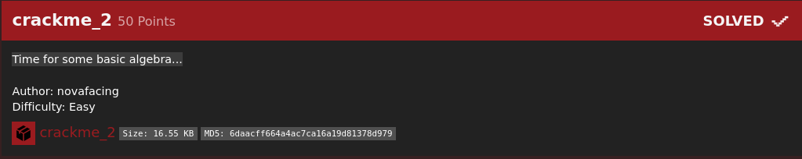
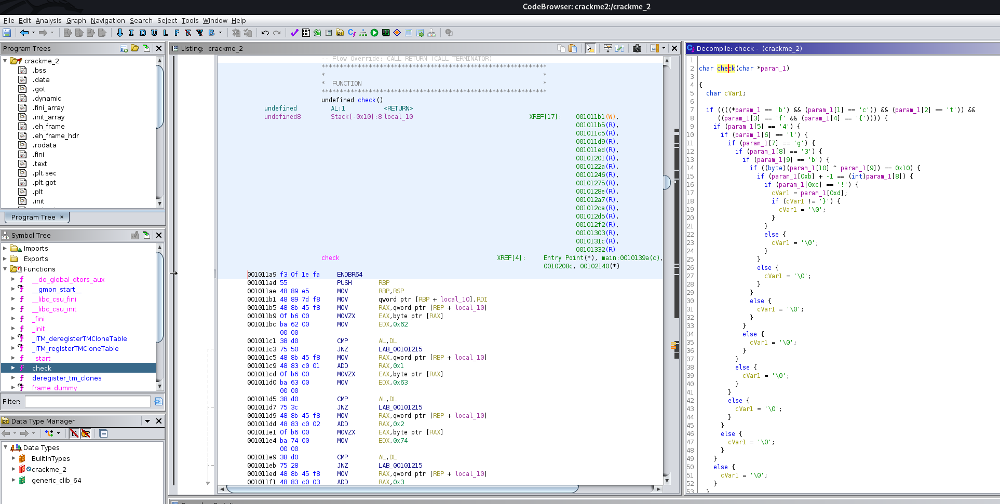
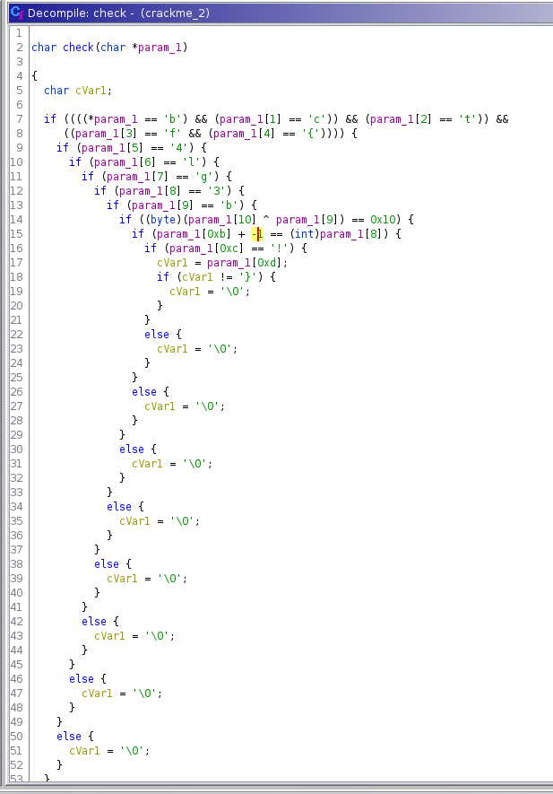
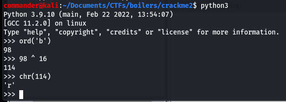

# crackMe2 (Reversing 50 points) 

## Description

Time for some basic algebra...

## Resources

[Download file](https://ctf.b01lers.com/download?file_key=fd2e5d90781cff1dad8585eea24ea5cfa2249a85588ddb9396a3d3f92bfaf20e&team_key=f525c3a1714f99e5c9c69495b11064d465f4c80aa98c6bae8d663f031246aff7)

## Solution

This challenge and solution is very similar to the last crackMe challenge. [You can read the writeup here for the Ghidra guide.](https://github.com/FidgetCube/CTF_writeups/tree/main/2022-bo1lersCTF/crackme(reversing)#readme)

Open up Ghidra, create a new project and load the downloaded binary. Open the binary in the code browser tool.

Similar to the last challenge, in the wild you should never execute a binary if you do not know what it does. CTFs are a slightly lower risk but there is still a chance it could harm your computer so *RUN IT AT YOUR OWN RISK*.

bctf{4lg3b r 4?! }
012345678910111213
              if ((byte)(param_1[10] ^ 'b') == 16) {
                if (param_1[11] + -1 == 3 {
                  if (param_1[12] == '!') {
                    cVar1 = param_1[13];
                    if (cVar1 != '}') {
                      cVar1 = '\0';
                    }

              if ((byte)(param_1[10] ^ param_1[9]) == 0x10) {
                if (param_1[0xb] + -1 == (int)param_1[8]) {
                  if (param_1[0xc] == '!') {
                    cVar1 = param_1[0xd];
                    if (cVar1 != '}') {
                      cVar1 = '\0';
                    }

## flag=bctf{4lg3br4!}

