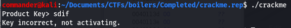

# crackme (reversing 50 points) 

## Description

Security through obscurity is no match for you!

Author: novafacing
Difficulty: Easy

## Resources

[binary download](https://ctf.b01lers.com/download?file_key=0df2f37d2976329e6a685a498563af96eb6db1c5d0a700ced4ea788cdc210654&team_key=f525c3a1714f99e5c9c69495b11064d465f4c80aa98c6bae8d663f031246aff7)

## Ghidra

To solve this i used Ghidra, if you already know how to use Ghidra you can <a href="#solution">skip the tutorial and go straight to the challenge solution.</a>

### Installation

To install Ghidra on Kali type the following command

`sudo apt install ghidra`

### Opening Ghidra and creating a project

Once installed you can open it by either typing `ghidra` into a terminal or search applications menu and click on the icon.  
When the program loads you can choose to create a new project or add a file to an existing project if you have one open.  
If it is just a quick analysis for a CTF, create a generic project that you can add many independent files to.

>File>New Project

>File>Open Project

>File>Import File  

### Creating a new project

>File>New Project

You will be prompted whether to make this a shared or non-shared project. Default is non-shared.

Select the folder path where you would like to store it and choose a meaningful name for the project. For CTF's i create a folder called *misc* in the CTF folder i create. Click finish.  

>File>Import File

Select the file you would like to import. Ghidra will prompt you for format type, and language if you have it. Leave defaults if you are unsure at this stage.  
Ghidra will provide a summary of the file you just added, as a novice to the program you won't know what to do with this info but it will become more relevant as you learn more about reversing with Ghidra.

Now you will see the file, imported into the project folder you just made.  
You can click on the Green Dragon icon "code Browser" in the Tool Chest section, but you will need to import the file again.

Select the file instead and right click on it, in the drop down menu select 

>Open with>Code Browser

Ghidra will ask if you want to analyze the file. Select yes and select Analyze with the default options.

Ghidra will now display several windows with the disassembled code.

## Challenge Solution

It is not best practice to execute a file that you have no idea what it does, in the case of a CTF it is somewhat safe to assume it is not malicious however EXECUTE THIS AT YOUR OWN RISK.

In order to run it, after download you will need to edit permissions to allow it to be executed. Type this command in your terminal 

`chmod +x crackme`

Then run the file with the command

`./crackme`

The prompt will ask you for a product key. Entering jibberish the program told me the key was incorrect and not activating. I'm going to use Ghidra to have a look at the code and find out how it tests for the right product key.

Load up the crackme file and have it analyzed in the Code Browser. Looking in the Symbol Tree on the middle left window of the default layout shows a list of functions contained in the binary. Clicking on this you will see many functions including main and check. Main is the default starting point for all programs and check seems like the right name of a function that would check user input for the product key. When we click on the *check* function, Ghidra will jump to the lines of code and we can see what is performed in the function.  
In the Decompile window on the right hand side we can see the lines of code from this function. We can see the function takes one argument (param_1) which is probably the user input that the program prompts for. We can see 22 nested if statements testing each indexed location of the user input (param_1) against a character. This is obviously testing for the product key and that means you can see the product key hardcoded into this program. Back to the description that security through obscurity is no match for us. Ghidra is a superior tool for a basic challenge like this. This would have been made way more difficult using a tool like GDB.

If you copy these characters out you will arrive at the flag.

# flag= bctf{133&_letmein_123}

