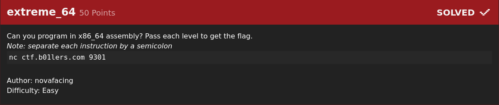
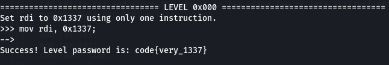
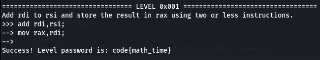
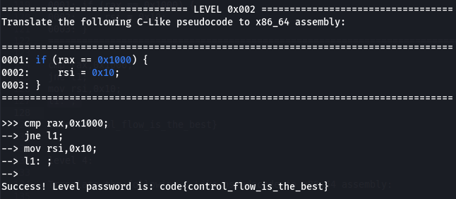
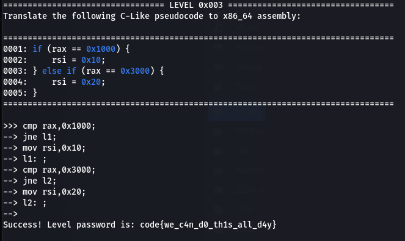
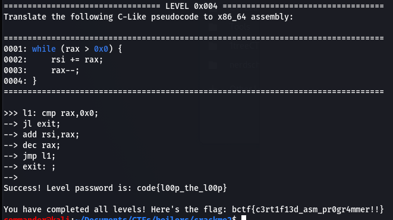
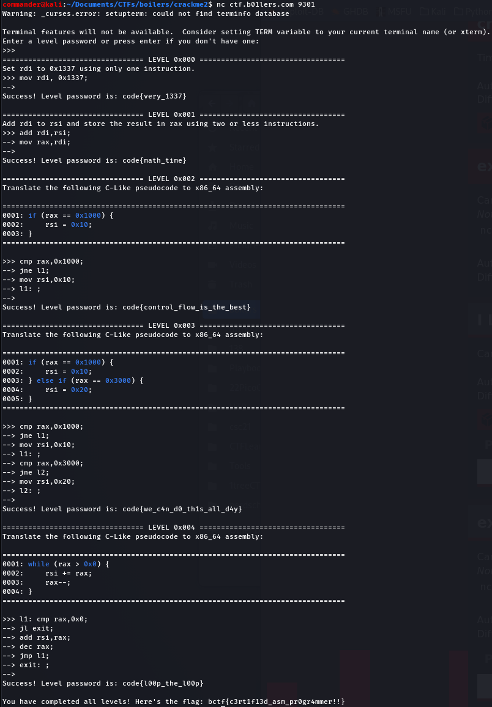

# extreme_64 (rev 50 points) 

## Description

Can you program in x86_64 assembly? Pass each level to get the flag.
Note: separate each instruction by a semicolon
nc ctf.b01lers.com 9301

Author: novafacing
Difficulty: Easy

## Resources

nc ctf.b01lers.com 9301

## Solution

Paste the netcat command into your terminal and you receive the following response;

>commander@kali:~/Documents/CTFs/boilers/crackme2$ nc ctf.b01lers.com 9301
>Enter a level password or press enter if you don't have one:
>>>> 

We don't have a password yet so hit enter.

## Level 1:

>================================= LEVEL 0x000 ==================================
>Set rdi to 0x1337 using only one instruction.

This is a basic assignment instruction. The pseudocode is basically move the value 1337 in hex into the variable/register named rdi.

>-->mov rdi, 0x1337;

>code{very_1337}

## Level 2:

>================================= LEVEL 0x001 ==================================
>Add rdi to rsi and store the result in rax using two or less instructions.

The addition and the assignment need to be separated into 2 commands here, there may be a more elegant way but this works. First step is to add the value of rsi to the value already held in the rdi variable/register, the second step is to move that value from rdi and store it in the rax register.

>-->add rdi,rsi;
>-->mov rax,rdi;

>code{math_time}

## Level 3:

>================================= LEVEL 0x002 ==================================
>Translate the following C-Like pseudocode to x86_64 assembly:
>================================================================================
>0001: if (rax == 0x1000) {
>0002:     rsi = 0x10;
>0003: }
>================================================================================

This was painful for me because i fumbled around controlling the flow of the code for awhile. 
It wasn't explained well but there were 2 tests server side that you needed to pass. It meant the during both passes you needed to ensure that the value 0x10 was not executed if the comnaprison failed. 
The first line compares (*cmp*) the hex value 1000 to the value stored in rax.
The second line *jne* is shorthand for *Jump if Not Equal* to l1 which is a label and my shorthand for label 1. This ensures that during the server side tests, the assignment of 0x10 into the rsi never gets executed unless rax and 0x1000 are the same. 
In the event that the comparison fails, the jump takes the code flow to line 4, referenced by *l1* which is an empty function. If the comparison passess and rax == 0x1000 then the code falls through to line 3 and the value 0x10 is stored in rsi.

>cmp rax,0x1000;
>jne l1;
>mov rsi,0x10;
>l1: ;

>code{control_flow_is_the_best}

## level 4:

>================================= LEVEL 0x003 ==================================
>Translate the following C-Like pseudocode to x86_64 assembly:
>================================================================================
>0001: if (rax == 0x1000) {
>0002:     rsi = 0x10;
>0003: } else if (rax == 0x3000) {
>0004:     rsi = 0x20;
>0005: }
>================================================================================

These instructions needed to be 'dumbed down' for assembly where there isn't really an else statement and so a second comparison needed to occur with different parameters, as seen on line 5. The code flow was controlled here by jumping the assignment statement on line 3 if the comparison on line 1 failed (*jne* Jump if Not Equal to). The second comparison occurs on line 5 and again the assignment on line 7 is skipped if the comparison fails. Labels l1 and l2 were both empty and were used to ensure parts of the code were skipped and controlled where the next instruction was read from.

>cmp rax,0x1000;
>jne l1;
>mov rsi,0x10;
>l1: ;
>cmp rax,0x3000;
>jne l2;
>mov rsi,0x20;
>l2: ;

>code{we_c4n_d0_th1s_all_d4y}

## level 5:

>================================= LEVEL 0x004 ==================================
>Translate the following C-Like pseudocode to x86_64 assembly:
>================================================================================
>0001: while (rax > 0x0) {
>0002:     rsi += rax;
>0003:     rax--;
>0004: }
>================================================================================

There are ways to implement loops in assembly however it requires control of the *edx* register in order to control how many times you loop. I attempted to move the value of rax into the edx so that it would stop with the value reached 0 however i was unable to modify the value in *edx*.
I created a label called exit and if the comparison of rax and 0 was true, it jumped to the end so no further instructions were executed. I tried to execute this using a *je* (Jump if Equal to) command however it fails on this code for a reason i was unable to figure out. The code executes correctly with a *jl* (Jump if Less than) conditional so it makes me believe there is a slight error in the question. The pseudocode states while the rax is greater than, however my code only executes when it evaluates to less than 0. So i believe the question should be written as (rax >= 0x0) as it does not jump with an equal to conditional (*je*). The *jmp l1;* command is effectively a loop always jumping back to the comparison to ensure it is executed again and again. The *jl exit;* command on line 2 jumps out of the loop when rax reaches 0.

>l1: cmp rax,0x0;
>jl exit;
>add rsi,rax;
>dec rax;
>jmp l1;
>exit: ;

>code{l00p_the_l00p}

Profit $$

# bctf{c3rt1f13d_asm_pr0gr4mmer!!}

A full dump of all levels in one hit can be seen below

