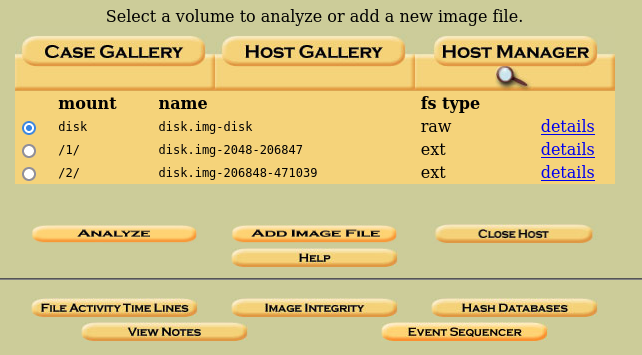
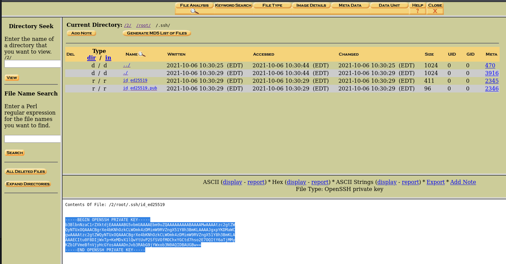
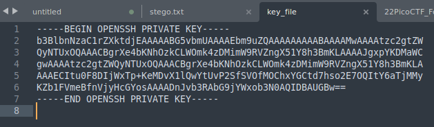
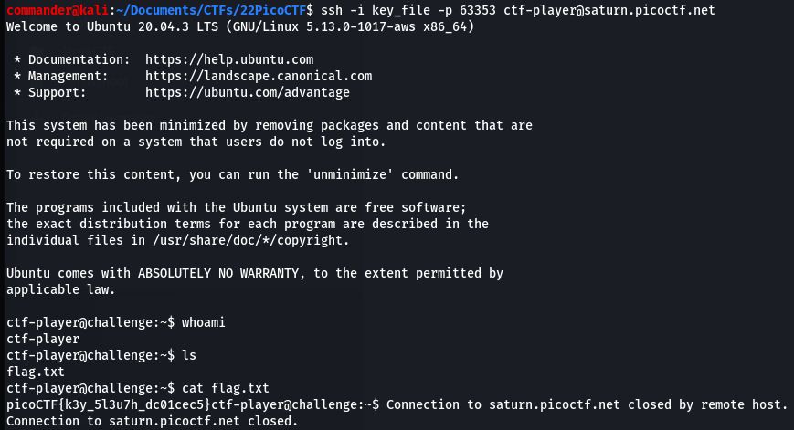

# Operation Oni (Forensics 300 Points) 

## Description

Download this disk image, find the key and log into the remote machine. Note: if you are using the webshell, download and extract the disk image into /tmp not your home directory.

    + Download disk image
    + Remote machine: ssh -i key_file -p 59798 ctf-player@saturn.picoctf.net

**You must launch an instance of this challenge in order to get the download link and SSH command. The port number is assigned dynamically and changes each time you restart a 30 min instance of this challenge.**

## Resources

[Link to picoCTF 2022 Forensics challenges page](https://play.picoctf.org/practice?category=4&originalEvent=70&page=1&solved=0)

## Solution

Download image file and extract the contents. 
Load the image file into Autopsy as a new case and select volume 2 and click Analyze. Select "file Analysis" from the top menu bar. 

Browse though the folders and locate folder */root/ssh*. Inside you will find an ed25519 private and public key pair. the public key has an extension of *.pub* and the private key does not have an extension. In this case, the private key is called *id_ed25519*.

Click on the private key and copy the contents into a text file back on your local host. **Ensure you include a new line at the end of the file or it will throw and invalid format error and prompt for a password**. 

Copy and paste the SSH command from the challenge description into your terminal. You must ensure that you either name your SSH key file as *key_file* or replace this argument in the command with the name of your file where you saved the SSH key. You must also be in the same working directory as the key_file when sending this command. 

This will get you logged in as ctf-player into the remote machine. Doing a click *ls* listing will show a file called flag.txt in the working directory, simply cat the contents of this file to print the flag.

Flag is

# picoCTF{k3y_5l3u7h_dc01cec5}
