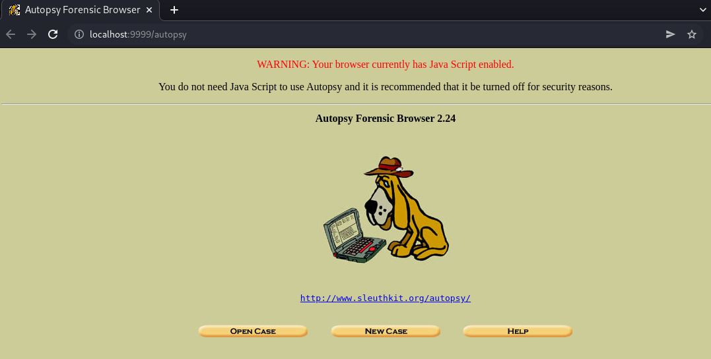
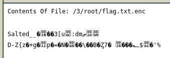
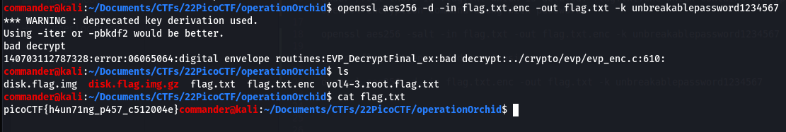

# Operation Orchid (Forensics 400 points) 

## Description

Download this disk image and find the flag. Note: if you are using the webshell, download and extract the disk image into /tmp not your home directory.

    Download compressed disk image

*No hints*

## Resources

[Disk Image]()

## Solution

Download and extract the provided disk image.

Load the .img image file into autopsy by creating a new case. Browse volume 3 and click on "file analysis" at the top of the screen.

Browsr the folder structure looking for files of value and under /root there is a file called flag.txt which has been deleted, flag.txt.enc which contains encrypted flag and then ash history containing command history including the openssl encryption command containing the password.

>openssl aes256 -salt -in flag.txt -out flag.txt.enc -k unbreakablepassword1234567

export flag.txt.enc and save it your local host. Decrypt the flag using the openssl command by adding the decrypt (-d), swap the encrypted flag as the input and text file as the output to write the decrypted flag to.

>openssl aes256 -d -in flag.txt.enc -out flag.txt -k unbreakablepassword1234567

Flag is 

#picoCTF{h4un71ng_p457_c512004e}
