# Operation Orchid (Forensics 400 points) 

## Description

Download this disk image and find the flag. Note: if you are using the webshell, download and extract the disk image into /tmp not your home directory.

    Download compressed disk image

*No hints*

## Resources

[Disk Image download](https://artifacts.picoctf.net/c/239/disk.flag.img.gz)

## Solution

If you already know how to use Autopsy you can skip straight to the <a href="#solution">challenge solution</a>

Download and extract the provided disk image.

You can locate Autopsy by typing ```Autopsy``` at the command prompt or by searching in the applications menu for the Autopsy icon in the forensics category.

A terminal window will open with instructions and a URL to paste in your browser, something similar to 
>http://localhost:9999/autopsy

<p align="center">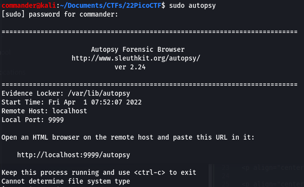</p>

Once you navigate to the page in your web browser, you are presented with the welcome screen. Select New Case

<p align="center"></p>

Next you are prompted to complete the case name, description and all investigator names that are working on the case. If this is a real forensic investigation you should use really meaningful names and be detailed.

<p align="center">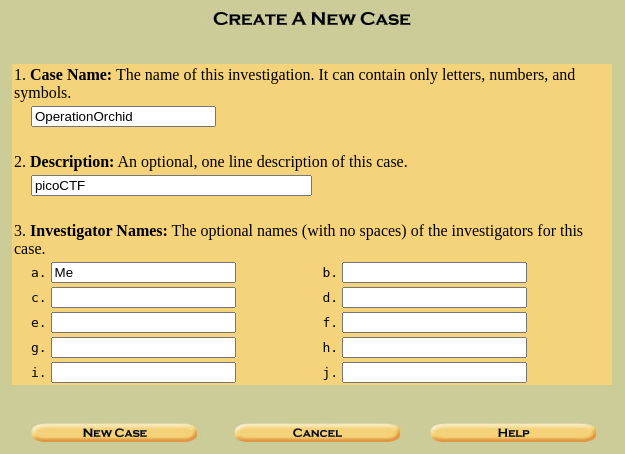</p>

Next you will want to select your newly created case from the list unless you are returning to work on an existing case.

<p align="center">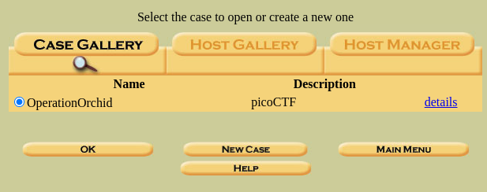</p>

Next click the add host button

<p align="center">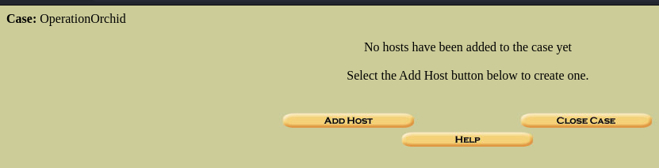</p>

Here you will need to enter details for each host you are going to add to the investigation, if you are adding more than one host then these names need to be meaningful and distinguishable between potentially multiple hosts of the same brand or same company so use unique identifiers like serial numbers etc.

<p align="center">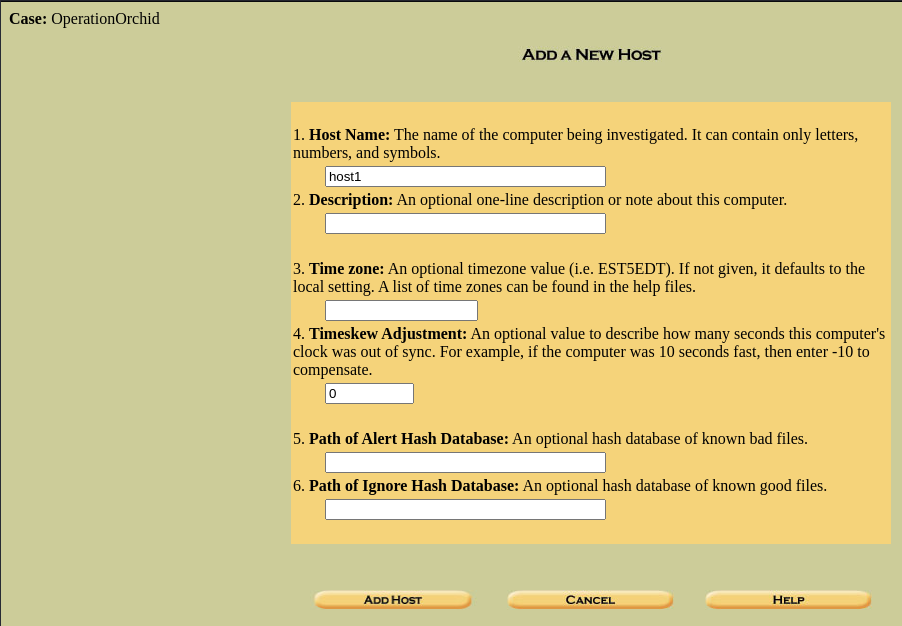</p>

You will received confirmation the host is added and the file path for the investigation files. Choose *add image* to load the forensic image.

<p align="center">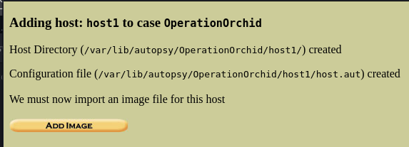</p>

Select an investigator from the list you created earlier and select ok.

<p align="center">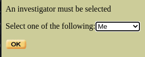</p>

Next choose *add image file*. 

<p align="center">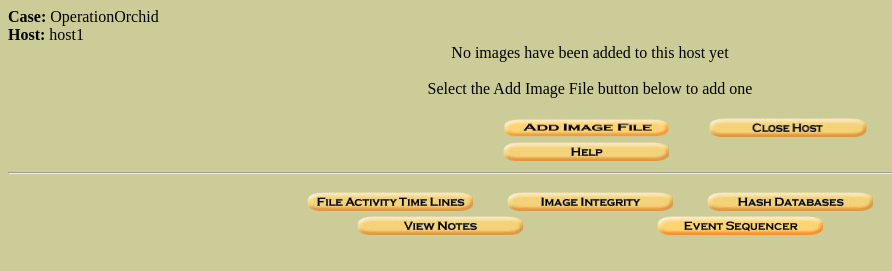</p>

Next you need to paste in the path to the forensic image you wish to add. Select if it is a disk or partition and then choose whether to create a symlink, copy the file or move the file. Ensure you heed the warning regarding moving the file.

<p align="center">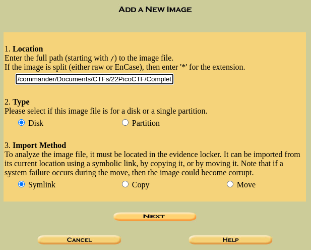</p>

The next screen you will see the details of an *mmls* scan down the bottom highlighting how many partitions were located on the image, their offsets and bytes per sector. You can choose whether to add all partitions or exlcude some here. You can also choose to calculate hashes of the image and verify the hash to ensure integrity of the import.

<p align="center">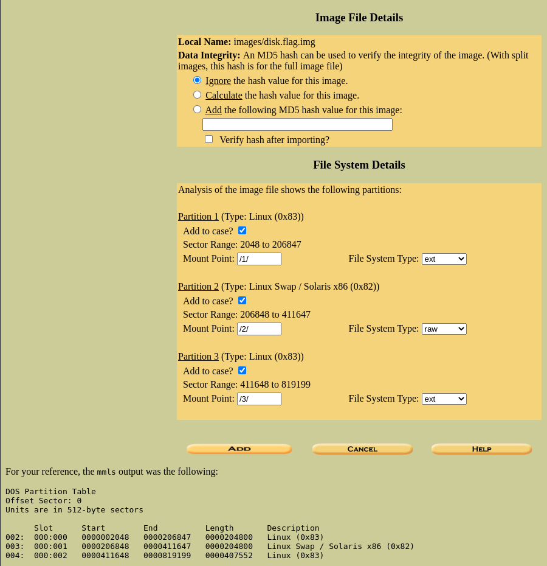</p>

You will see a summary of your selections.

<p align="center">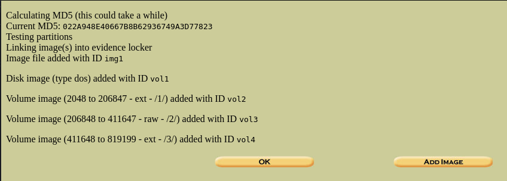</p>

Now it is time for the analysis. To browse the file system, choose which partition you wish to analyse and select *Analyze*.

<p align="center">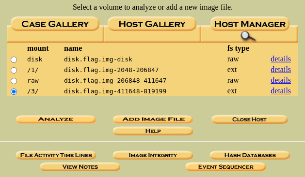</p>

Here you can navigate through the file system as though it was mounted on your local computer. 

<p align="center">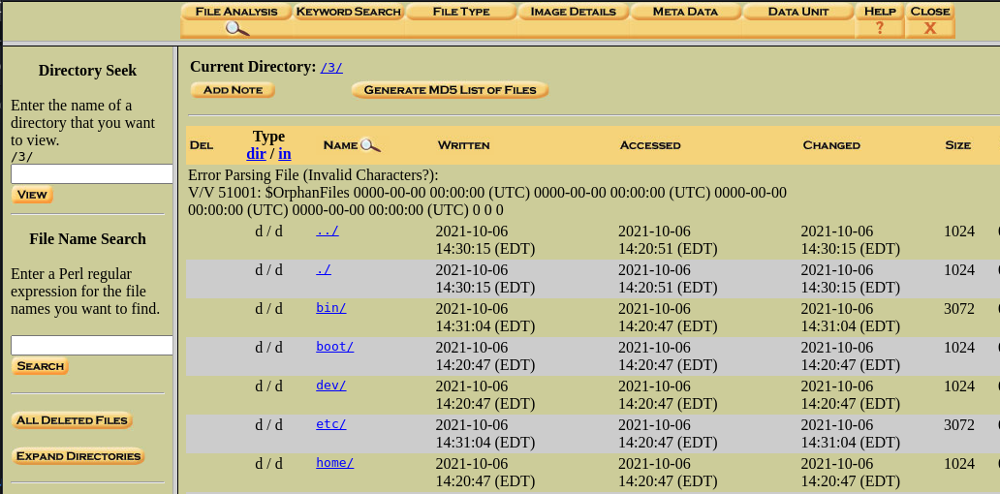</p>

<a id="solution"></a>
Browse the folder structure looking for files of value and under /root there is a file called flag.txt which has been deleted, flag.txt.enc which contains the encrypted flag. Also of note and probably the best reason to use Autopsy here is there is hidden file displayed called *.ash_history* which contains the command history. You can see the commands used to create the flag and delete the file but most importantly is the openssl command used to encrypt the flag which also shows the password used.

>openssl aes256 -salt -in flag.txt -out flag.txt.enc -k unbreakablepassword1234567

<p align="center">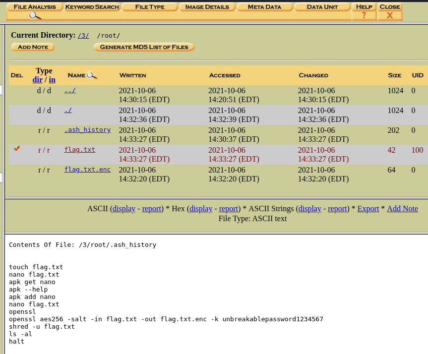</p>

export flag.txt.enc and save it your local host.

<p align="center"></p>

Decrypt the flag using the openssl command by adding the decrypt argument *-d*, ensure you pass the encrypted flag as the input *-in* and stipulate a text file as the output *-out* to write the decrypted flag to. Leave the password form the original command as this is required to decrypt the flag.

>openssl aes256 -d -in flag.txt.enc -out flag.txt -k unbreakablepassword1234567

<p align="center"></p>

Flag is 

# picoCTF{h4un71ng_p457_c512004e}
