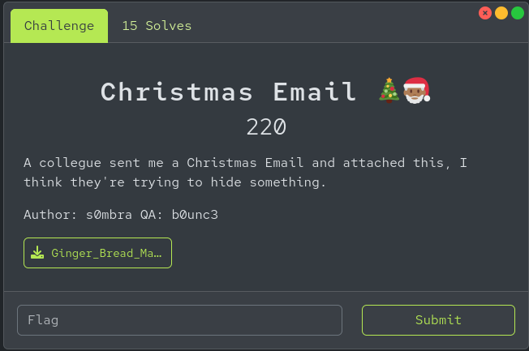
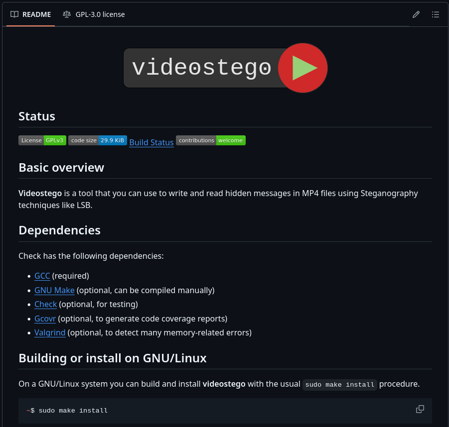
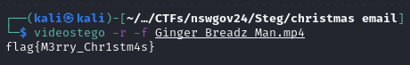

# Christmas Email (steganogprahy) 

## Description

<p align="center"></p>

## Resources

[Provided challenge file]()

## Solution

Downloading and extracting the challenge file we get a video in .mp4 format. There is a tol called videostego which can be used for extracing hidden data using LSB methods and the github page is found here ```https://github.com/JavDomGom/videostego/tree/main```

<p align="center"></p>

Next steps are to download and install the tool to get it running. From your tools folder, download the tool from the github repo
```
git clone https://github.com/JavDomGom/videostego.git
  ```

Change directory into the tools folder
```
cd videostego
  ```

Install the tool
```
sudo make install
  ```

Now it should be up and running and installed in your PATH so that you can run it from any location in the environment.

Navigate to the challenge folder where your challenge file is located and run the tool over the file.

```
./videostego -r -f Ginger_Breadz_Man.mp4
  ```
# Profit$$

<p align="center"></p>

## flag{M3rry_Chr1stm4s}


