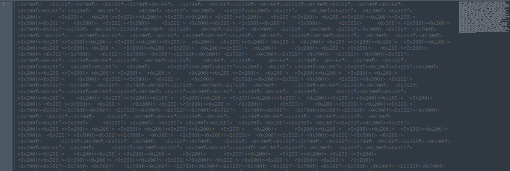
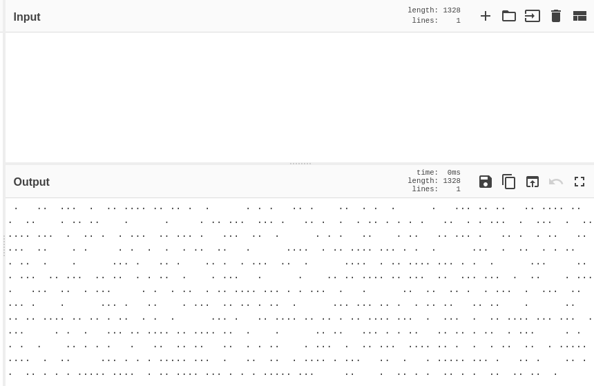
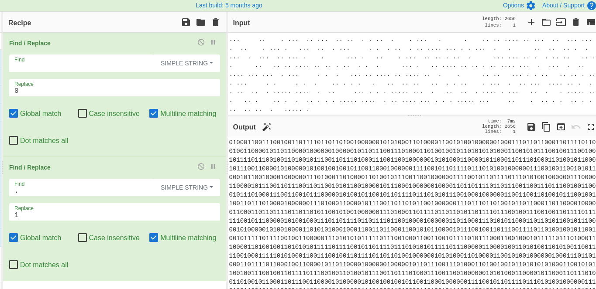
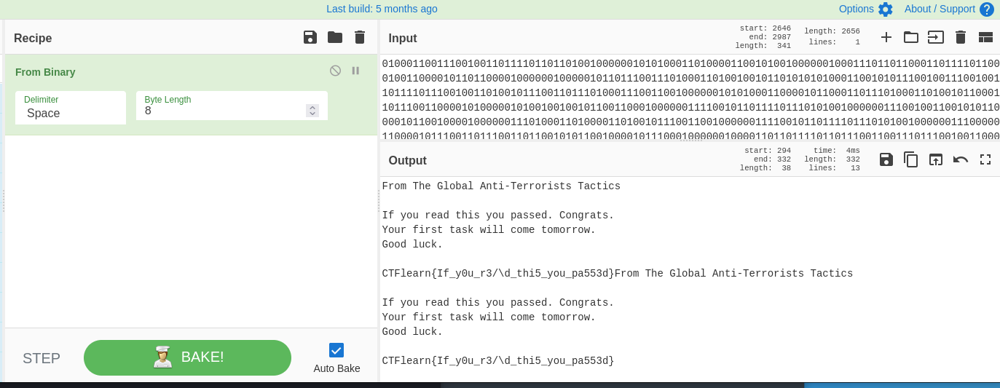

# Blank Page (Forensics/Steganography) 30 points

## Description

I've just graduated the Super Agent School. This is my first day as a spy. The Master-Mind sent me the secret message, but I don't remember how to read this. Help!

## Resources

[Provided file](https://github.com/FidgetCube/CTF_writeups/blob/main/ctfLearn/BlankPage(Forensics%2C%20Steganography)/TheMessage.txt)

## Solution

Download the provided file and when you open it in a text editor, nothing is displayed. Selecting all and changing font colours doesn't reveal tone on tone steganography. If you open it in an editor like sublime you will have a bunch of "zero width" characters represented in unicode '<0x200f>'.

Pasting this text into CyberChef will reveal a mix of dots and spaces and since there is only 2 different types of characters displayed we are going to assume this is encoded binary. 

Trying to replace the input with output in CyberChef didn't work due to the encoding so i had to copy the output from CyberChef and paste it back into sublime, from there i then copied the dots and spaces back into CyberChef as the decoded characters and then used find and replace to replace all spaces with a 0, and all dots with a 1.

Then you should be able to replace the input with the output and convert from binary to reveal the flag.

