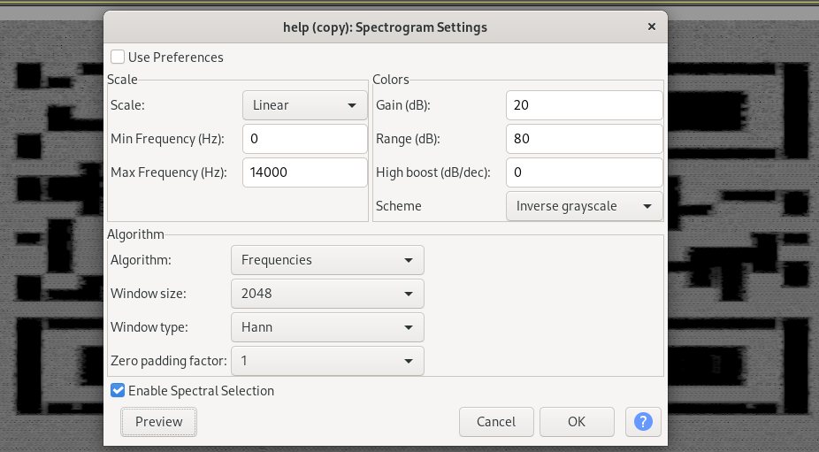
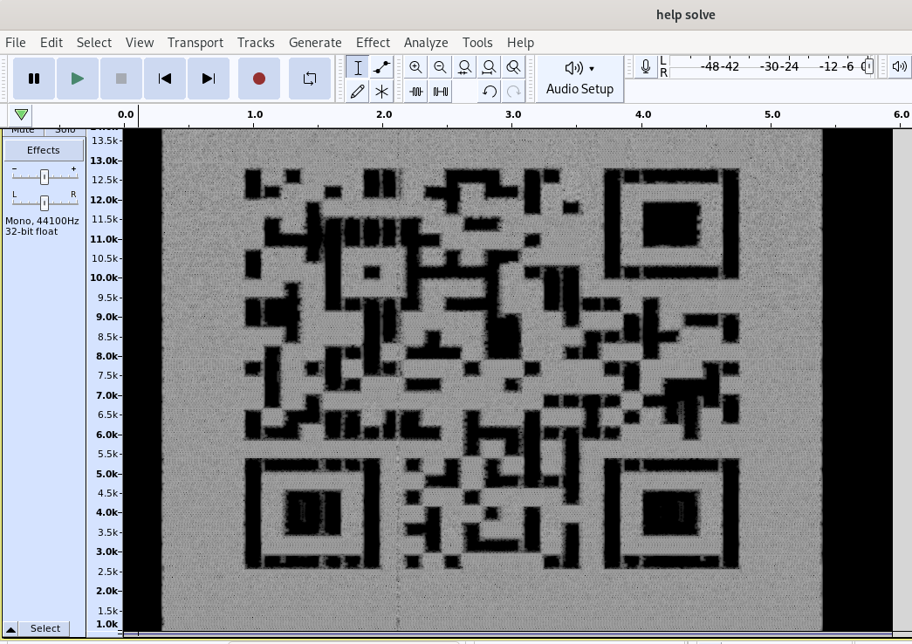
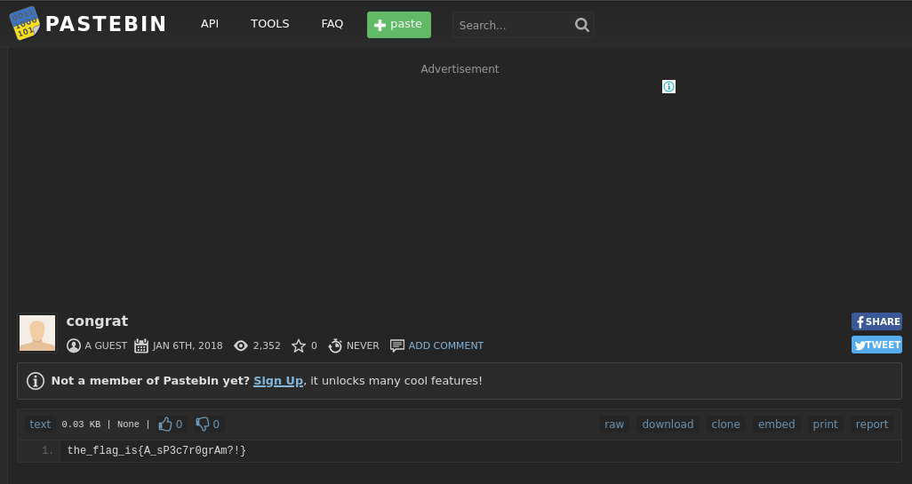

# Seeing is Believing (Forensics, Steganography) 

## Description

Hard - 70 points  

My colleague's an astronaut who's currently on a mission orbiting in space. Just a few hours ago, unfortunately, his communication device caught fire so he's unable to report back to base. I did, however, receive a strange file that I can't seem to open. I think it may shed some light on his situation. Can you help me save poor boy Johnny? 

## Resources

[Provided file](https://mega.nz/#!LTRUTaZb!9Nh0NwDONJQiOThif3G62evP8H_W9eIJSu0PdBQWKyg)

## Solution

Download the file 'help.me' and run the file command to determine what the file type is. The file is identified as an '.ogg' extension which is a type of audio format, so change the file extension to 'help.ogg' and load it up in Audacity

In audacity, turn on Spectogram from the drop down menu on the left. We can change some Spectogram settings to see if we can find any data in the file. Open the Spectogram settings and the 3 settings you need to change are;  
Window Size: change to 2048  
Max Frequency (Hz): change to 14000  
Scheme: change to Inverse Greyscale

You should start to see a QR code taking shape in the background. Increasing the frequency range reveals the rest of the data from higher frequencies not initially displayed, and converting the scheme to inverse greyscale allows for better scanning of the QR code. 

Take a screenshot or scan it with your phone and the QR code will reveal a [pastebin link](https://pastebin.com/zhEhyp3G) which reveals the flag.

## the_flag_is{A_sP3c7r0grAm?!}
