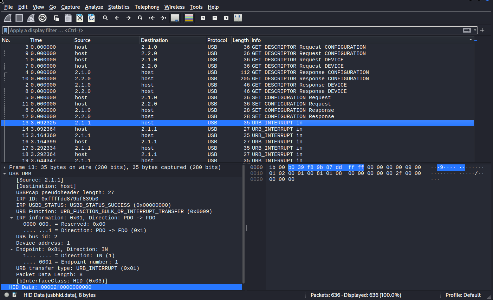
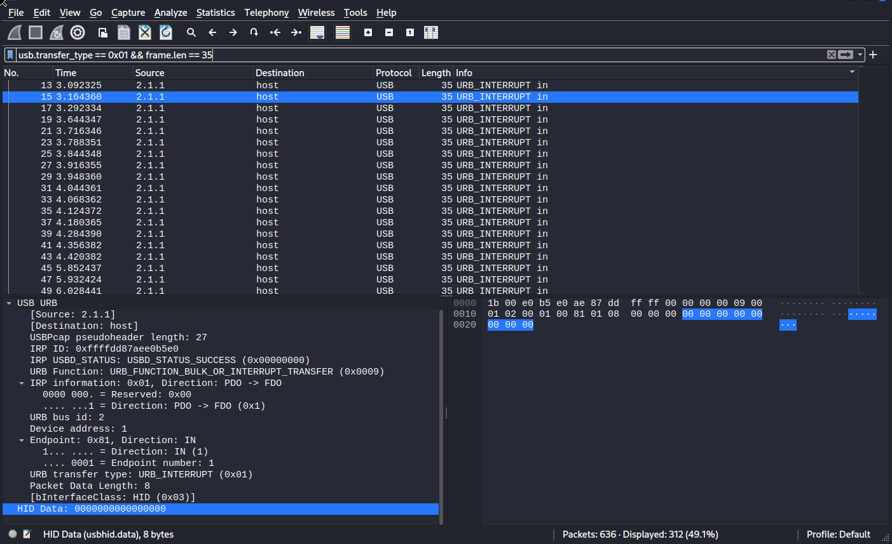
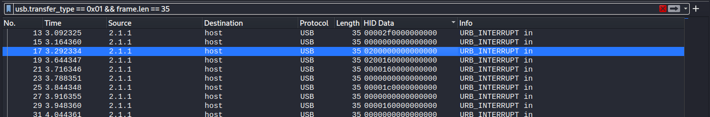
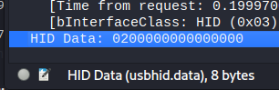
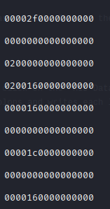
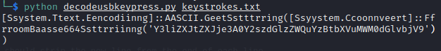
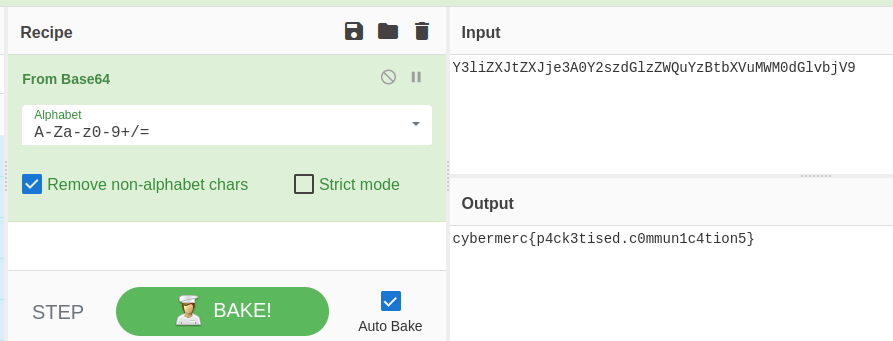

# USBkeylogger (Forensics) 

## Description

200 points  


## Resources

[Challenge file](https://github.com/FidgetCube/CTF_writeups/blob/main/misc/USBkeylogger/usbKeyLogged.pcap)  
[Refernce for solve](https://blog.stayontarget.org/2019/03/decoding-mixed-case-usb-keystrokes-from.html)
[Solution script](https://github.com/FidgetCube/scripts/blob/main/decodeusbkeypress.py)

## Solution

Opening the .pcap in WireShark, we can see some communication in USB protocol. Of note to us is the packets that show "URB_INTERRUPT in" in the info field, after the configuration packets. 

<p align="center"></p>

The packets from the source keyboard are 35 bytes in length, and you can see the field "HID Data:" containing the obfuscated keystrokes, which i'll get to in a minute. You can isolate these with the following filter;

```
usb.transfer_type == 0x01 && frame.len == 35
  ```

<p align="center"></p>

Now in the bottom left view panel, click to expand "USB URB" and locate the field at the end "HID Data", right click on this and "Apply as column". This is the field that contains the keystroke pressed, unforunately we have to convert it from the [HID usage tables located here](https://usb.org/sites/default/files/hut1_4.pdf)

<p align="center"></p>

Next step i used tshark to extract the "HID Data" from the pcap, into a text file so i can use python to automate the conversion. If you click on the "HID Data" section in the frame inspector, Wireshark displays down the bottom the field name as usbhid.data which we will need to feed to tshark to extract. 

<p align="center"></p>

The following command pulls the usbhid.data field out, strips the colons and writes each line to a file called keystrokes.txt 

```
tshark -r usbKeyLogged.pcap -T fields -e usbhid.data | tr -d : > keystrokes.txt
  ```

When i ran this, i got extra blank lines in the file which caused an error with my python script so do a find "0\n" and replace "0" which should strip the new line from the end of each line.

<p align="center"></p>

Once we have the file ready to go, i got my hands on a [python script here](https://github.com/FidgetCube/scripts/blob/main/decodeusbkeypress.py) that reads the input and converts the values to ASCII based on the HID tables. So next we just point and shoot that script at the file for the output.

<p align="center"></p>

>[Ssystem.Ttext.Eencodiinng]::AASCII.GeetSstttrring([Ssyystem.Ccoonnveert]::FfrroomBaasse664Ssttrriinng('Y3liZXJtZXJje3A0Y2szdGlzZWQuYzBtbXVuMWM0dGlvbjV9'))  

From here we can see the preceeding text shows base64 encoding, so copy the string in the parenthesis and decode using your preferred method, CyberChef works perfect.

<p align="center"></p>

## cybermerc{p4ck3tised.c0mmun1c4tion5}

