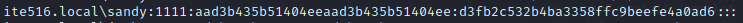

# ntdsCrack (Password Cracking) 

## Description

1. Can you crack the NTDS.dit and get the password of the user starting with "s"
2. Can you crack the administrators password

## Resources

[Resource files](https://github.com/FidgetCube/CTF_writeups/blob/main/misc/ntdsCrack/_resources/ntds.dit1.zip)

Folder Structure:
\ntdsutil
  + \Active Directory
    + \ntds.dit
    + \ntds.jfm
  + \Registry
    + SECURITY
    + SYSTEM

## Solution

*NTDS.DIT is the main Active Directory (AD) database file which stores information about users, groups, group memberships and password hashes for all users in the domain. It is stored on the DC, at a default location of ```%SystemRoot%\NTDS\ntds.dit```  
**The SYSTEM registry hive contains the boot key that is used to encrypt information in the ntds.dit file. Therefore the SYSTEM Registry Hive is required in order to decrypt ntds.dit file

Download the files and unzip the archive
```
unzip "ntds.dit1.zip"
```

First thing we are going to do is run impacket over the SYSTEM registry dump, ensure impacket is installed.
```
pip3 install impacket
```
Use impacket-secretsdump and point to the SYSTEM and NTDS.dit artefacts under *-system* and *-ntds* respectively. 

```
impacket-secretsdump -system ../registry/SYSTEM -ntds ntds.dit LOCAL
```

You can see below that this commands successfully dumps the users and their NTLM hashes in the following format (domain\uid:rid:lmhash:nthash)

<p align="center"></p>

## Challenge 1

We can see that the users name which starts with "s" is Sandy. We are going to focus on cracking the NT part of her password which is the second half, separated by the colon.

<p align="center"></p>

```
d3fb2c532b4ba3358ffc9beefe4a0ad6
```

I'm going to paste this hash into a text file so i can run hashcat over it

```
echo "d3fb2c532b4ba3358ffc9beefe4a0ad6" > hash.txt
```

```
cat hash.txt
```

<p align="center"></p>

Now for HashCat using the rockyou wordlist, we are using the following flags;
```-m 1000``` Which sets the hash type mode with 1000 being the value of NTLM since that is the hash type we are trying to crack
```-a 0``` is the flag for attack mode and the value 0 = [hash][dictionary]

```
hashcat -m 1000 -a 0 hash.txt /usr/share/wordlists/rockyou.txt
```

We can see this successfully cracked the password with the following hash:password

```
d3fb2c532b4ba3358ffc9beefe4a0ad6:q1w2e3r4t5y6 
```

So the password is: 

### sandy:q1w2e3r4t5y6 

<p align="center"></p>

## Challenge 2: 

We need to attack the NT part of the administrator hash
```
Administrator:500:aad3b435b51404eeaad3b435b51404ee:1628488e442316500a176701e0ac3c54:::
```

Write it to a text file

```
echo "1628488e442316500a176701e0ac3c54" > hash2.txt
```

<p align="center"></p>

I attempted the same command with the admin password, which fails.

<p align="center"></p>

So i used dive.rule to help crack the password
```
sudo hashcat -m 1000 -a 0 hash2.txt /usr/share/wordlists/rockyou.txt -r /usr/share/hashcat/rules/dive.rule 
```

you can see below that dive.rule was successfull and we get the password

```
1628488e442316500a176701e0ac3c54:Summer2021
```

<p align="center"></p>

### administrator:Summer2021
